# RamboQuant — Complete Design Guide

The full developer onboarding document. Read top-to-bottom to understand the codebase end-to-end; reference specific sections for ongoing work. Flow diagrams use Mermaid. Tech-stack rationale (why/what/how/where) is interleaved with each subsystem rather than collected separately — easier to learn in context.

**Goal:** anybody who reads + understands this document should be able to modify and enhance features by making the actual code changes. Each subsystem section names the files; **Part IX** at the end is a cookbook of common change recipes with exact-diff-level guidance.

---

## Table of contents

### Part I — Foundation
1. [Architecture overview](#1-architecture-overview)
2. [Tech stack — at a glance](#2-tech-stack--at-a-glance)
3. [Core architectural principles](#3-core-architectural-principles)
4. [Concurrency model](#4-concurrency-model)
4.5. [Data layer — implementation detail](#45-data-layer--implementation-detail)

### Part II — Order lifecycle
5. [Order placement — single ticket (Ticket tab)](#5-order-placement--single-ticket-ticket-tab)
6. [Order placement — basket (Chain tab)](#6-order-placement--basket-chain-tab)
7. [Chase loop lifecycle](#7-chase-loop-lifecycle)
8. [The order/chase/template tripod](#8-the-orderchasetemplate-tripod)

### Part III — Templates + exits
9. [Template attach pipeline](#9-template-attach-pipeline)
10. [4-default template matrix](#10-4-default-template-matrix)
11. [Template override merge](#11-template-override-merge)
12. [Chase loop invariants](#12-chase-loop-invariants)
13. [Trail-stop subsystem](#13-trail-stop-subsystem)

### Part IV — Brokers
14. [Broker abstraction](#14-broker-abstraction)
14.5. [Broker abstraction — implementation detail](#145-broker-abstraction--implementation-detail)
15. [How to add a new broker](#15-how-to-add-a-new-broker)
16. [Broker gotchas](#16-broker-gotchas)

### Part V — Frontend
17. [Frontend modal state](#17-frontend-modal-state)
18. [Frontend state architecture](#18-frontend-state-architecture)
19. [The preview pipeline](#19-the-preview-pipeline)

### Part VI — Runtime
20. [Background task topology](#20-background-task-topology)
21. [Data refresh — PositionStrip + Dashboard](#21-data-refresh--positionstrip--dashboard)
22. [Demo mode](#22-demo-mode)
22.5. [Investor portal — token-as-credential](#225-investor-portal--token-as-credential)

### Part VII — Operations
23. [How to add a new template field](#23-how-to-add-a-new-template-field)
24. [Testing philosophy](#24-testing-philosophy)
25. [Logging discipline](#25-logging-discipline)
26. [Deployment notes](#26-deployment-notes)
27. [Sprint history + audit fixes](#27-sprint-history--audit-fixes)

### Part VIII — Wrap-up
28. [Reading order for a new developer](#28-reading-order-for-a-new-developer)
29. [When in doubt](#29-when-in-doubt)
30. [Operator's mental model](#30-operators-mental-model)

### Part IX — Change recipes (cookbook)
31. [Recipe: add a new route](#31-recipe-add-a-new-route)
32. [Recipe: add a column to an existing table](#32-recipe-add-a-column-to-an-existing-table)
33. [Recipe: add a new background task](#33-recipe-add-a-new-background-task)
34. [Recipe: add a new agent action](#34-recipe-add-a-new-agent-action)
35. [Recipe: add a new template field (worked example)](#35-recipe-add-a-new-template-field-worked-example)
36. [Recipe: add a new broker capability flag](#36-recipe-add-a-new-broker-capability-flag)
37. [Recipe: add a new page](#37-recipe-add-a-new-page)
38. [Recipe: add a setting](#38-recipe-add-a-setting)
39. [Recipe: change an existing default template](#39-recipe-change-an-existing-default-template)
40. [Recipe: wire a new notification channel](#40-recipe-wire-a-new-notification-channel)
41. [Recipe: ship a fix to dev + main](#41-recipe-ship-a-fix-to-dev--main)
42. [Cross-cutting checklist before every commit](#42-cross-cutting-checklist-before-every-commit)

> Tech-stack rationale boxes appear inline as ⚙ **TECH: WHY · WHAT · HOW · WHERE** callouts throughout. Look for the gear glyph.

---

# Part I — Foundation

## 1. Architecture overview

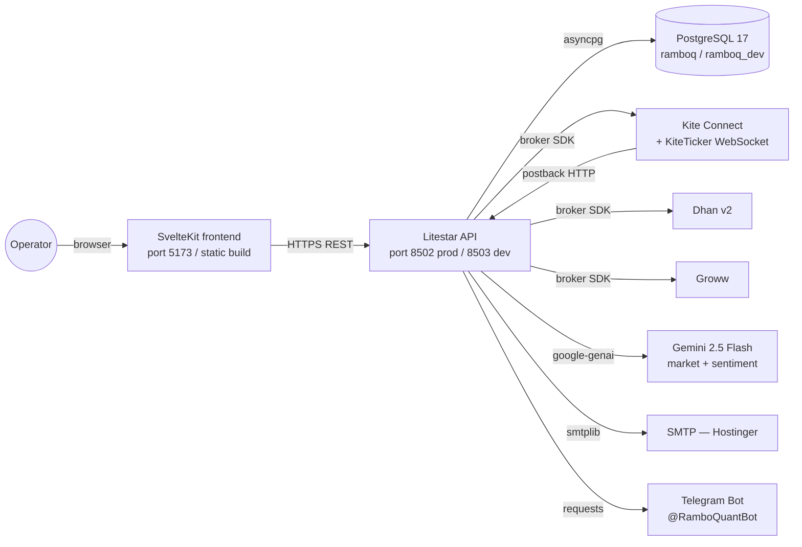

| Layer | Tech | Key files |
|---|---|---|
| Frontend | SvelteKit + Svelte 5 runes + ag-Grid + hand-rolled SVG charts | `frontend/src/` |
| API | Litestar 2.x + msgspec.Struct schemas | `backend/api/` |
| DB | PostgreSQL 17 + SQLAlchemy 2.x async + asyncpg | `backend/api/database.py`, `models.py` |
| Brokers | Vendor SDKs behind a unified `Broker` ABC | `backend/shared/brokers/` |
| Background | asyncio tasks spawned at app startup | `backend/api/background.py` |

---

## 2. Tech stack — at a glance

Each choice has a **why/what/how/where** callout inline where relevant (marked by ⚙). Key stacks:

| Layer | Tech | Why |
|---|---|---|
| API | Litestar 2.x + msgspec | ~10× faster JSON encode/decode than pydantic on big payloads |
| DB | PostgreSQL 17 + SQLAlchemy 2.x async + asyncpg | Fast, reliable, static typing, JSONB for attached_gtts_json blob |
| Frontend | SvelteKit + Svelte 5 runes + ag-Grid | Smaller bundle, native reactivity, row virtualization for 1000+ ticks/sec |
| Charts | Hand-rolled SVG (no Chart.js) | 150KB saved, tighter control, palette integration |
| Concurrency | asyncio + single uvicorn worker | Kite token affinity, in-process locks, background task state |
| Notifications | Telegram (Bot API), SMTP (Hostinger) | Free, reliable, works everywhere |
| WebSocket | KiteTicker (Twisted reactor → SSE bridge) | Sub-second LTP updates without burning rate limit |

Full rationale for each technology appears as **⚙ TECH** callouts throughout this doc (e.g. §3.1 broker abstraction, §4.2 KiteTicker threading, §4.3 background task lifecycle).

---

## 3. Core architectural principles

### 3.1 Single source of truth at the broker boundary

The `Broker` abstract base class (`backend/shared/brokers/base.py`) is the **only** place vendor differences should leak. Every route, agent, and background task talks to a `Broker` instance via `get_broker(account)` from the registry.

⚙ **TECH** — `WHY` Vendor SDKs disagree on EVERYTHING (qty units, status strings, GTT shape). Letting that disagreement propagate past the adapter boundary creates bug surface area in every consumer. `WHAT` The ABC declares ~20 methods (place_order, modify_order, cancel_order, orders, holdings, positions, funds, ltp, quote, historical_data, place_gtt, modify_gtt, cancel_gtt, get_gtts, instruments, profile, holidays, order_status, trades, basket_order_margins). `HOW` New broker? Implement every method, translate to Kite shape in `_normalise_*` helpers, register in `_ADAPTERS`. Capability gaps go in `BrokerCapabilities` — never inline `if broker_id == "groww"`. `WHERE` `backend/shared/brokers/base.py` (ABC); `backend/shared/brokers/kite.py` / `dhan.py` / `groww.py` (implementations); `backend/shared/brokers/capabilities.py` (matrix).

### 3.2 Idempotency is the default

Every path that places a broker order or GTT can fire twice — postbacks arrive twice, chase terminals race postbacks, reconcile sweeps re-fire attaches. Four patterns make this safe:

| Pattern | Where | What it guards |
|---|---|---|
| `attached_gtts_json IS NULL` check | `_fire_template_attach_on_fill` | Double-place TP/SL/Wing at broker |
| `_TEMPLATE_ATTACH_LOCKS[parent_row_id]` | Same function | Concurrent races within the same row |
| `_KILLED_ORDER_IDS` dict with 60-min TTL | `chase.py` | Operator kills landing on stale `broker_order_id` |
| `MAX(prior, cumulative)` clamp | `_record_partial_fill` | Restart causing cumulative to be added again |

**When adding a new fill-time side-effect, ask:** can my handler fire twice for the same parent? If yes, what's the idempotency check?

### 3.3 Database is authoritative; in-memory is fast-path

The single uvicorn worker (`--workers 1` in prod — see §4.1) means in-process locks are sufficient, but the DB is still the source of truth. After a restart, every chase loop recovers via `recover_from_db` and re-derives state. Don't store anything operationally meaningful in in-process state without a DB write to back it up.

The `attached_gtts_json` column is a deliberate small-state JSON blob rather than a foreign-key normalized table:
- ✅ Atomic write per parent — no half-attached state visible to readers
- ✅ Easy to refactor the GTT spec shape (just version the JSON inside)
- ❌ Harder to JOIN against; we accept this because GTT inspection is rare

### 3.4 Async by default, sync when forced

Everything API-facing is `async def` over asyncpg. Broker SDK calls are sync — Kite/Dhan/Groww use `requests` under the hood — so we wrap them in `asyncio.to_thread(...)` to keep the event loop unblocked. The threadpool sizing is the default (32 workers); we've never seen it saturate because broker API calls are sub-second.

**Anti-pattern to avoid:** `broker.method()` directly in an `async def` route handler. Even if it returns "fast," a single 2-second hang stalls every other request on that worker.

### 3.5 Demo mode = signed-out + prod branch

Demo isn't a separate code path — it's a runtime guard at the API boundary (`backend/api/auth_guard.py`) plus a frontend flag pulled from context. The same routes serve authenticated + demo traffic; the guard masks accounts and blocks writes. This means **a feature works in demo the moment it works for read-only sessions** — there's no separate "demo enablement" step to forget.

---

## 4. Concurrency model

### 4.1 Why one uvicorn worker?

`--workers 1` in prod is **intentional** for three reasons:

- **Kite session affinity:** multiple workers would invalidate each other's Kite tokens because Kite enforces one active session per IP.
- **In-process locking is enough:** all locks are `asyncio.Lock` instances; we never need multiprocess coordination.
- **Background tasks need shared state:** the trail-stop poller's in-memory state (`_TEMPLATE_ATTACH_LOCKS`, the ticker manager's `_tick_map`) is process-scoped. Multi-worker would require Redis or similar.

If we ever scale horizontally we'd need to externalize: tokens → DB, locks → DB advisory locks or Redis, ticker state → a separate fanout service.

### 4.2 KiteTicker threading

`KiteTicker` runs Twisted internally — **all WebSocket callbacks fire on a Twisted reactor thread**, not the asyncio event loop. The `TickerManager` bridges this:
- Twisted thread writes `_tick_map[token] = ltp` under a `threading.Lock`
- Async handlers read via `get_ltp(token)` — same lock, briefly held

The lock is non-reentrant and the critical section is O(1) so no deadlock risk.

⚙ **TECH** — `WHY` Twisted reactors can't see asyncio's event loop, so we can't `await` from a tick callback. Lock-protected dict is the simplest viable bridge. `WHAT` `TickerManager._tick_map: dict[int, float]` + `_tick_lock: threading.Lock`. `HOW` Tick handler does `with self._tick_lock: self._tick_map[token] = ltp`. Async reader does the same under the lock, briefly. `WHERE` `backend/shared/helpers/kite_ticker.py`.

**If you add anything that runs on the Twisted side**, never call `asyncio.run_coroutine_threadsafe` without testing both directions of the round-trip. The reactor doesn't know about asyncio's event loop.

### 4.3 Background task lifecycle

All background tasks are spawned in `app.on_startup` via `asyncio.create_task(...)`. They run forever; cancellation only happens at app shutdown. Each task is responsible for its own error handling — an uncaught exception kills the task silently. Every task body should be:

```python
async def _task_X():
    while True:
        try:
            ...real work...
        except Exception as e:
            logger.exception(f"_task_X iteration failed: {e}")
        await asyncio.sleep(interval)
```

The `try/except` around the loop body is non-negotiable. We've burned hours debugging "why did the trail stop go silent" only to discover an unhandled `KeyError` ate the task three days earlier.

---

## 4.5. Data layer — implementation detail

This section is the "if you're modifying the data layer, here's the actual shape" reference. The data layer = SQLAlchemy 2.x async ORM + PostgreSQL + asyncpg driver. Read this end-to-end before changing any table.

### 4.5.1 Topology

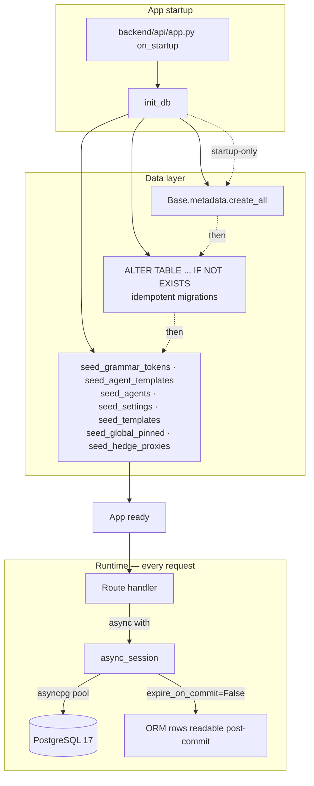

### 4.5.2 File map

| File | Purpose |
|---|---|
| `backend/api/database.py` | Engine + session factory + `init_db` (the only place we touch DDL) |
| `backend/api/models.py` | Every SQLAlchemy declarative model. One file by convention so the data shape is one grep away. |
| `backend/api/schemas.py` | msgspec.Struct wire types. Mirror of models for HTTP responses. |
| `backend/shared/helpers/settings.py` | `SEEDS` list + cached settings reader (`get_int / get_float / get_bool / get_string`) |
| `backend/api/algo/templates_seed.py` | `SYSTEM_TEMPLATES` + the seeder |
| `backend/api/algo/grammar.py` | `_SYSTEM_TOKENS` + grammar registry seeder |
| `backend/api/cache.py` | In-memory TTL cache with per-key locking (NOT a substitute for the DB; cache invalidates on PATCH) |

### 4.5.3 Engine + session factory

`database.py` is small and worth reading in full. Key shape:

```python
# backend/api/database.py
engine = create_async_engine(
    DATABASE_URL,            # postgresql+asyncpg://...
    echo=False,
    pool_size=5,             # max connections kept warm in the pool
    max_overflow=10,         # extra one-off connections when pool exhausted
)

async_session = async_sessionmaker(
    engine,
    expire_on_commit=False,  # load-bearing — see 4.5.5
    class_=AsyncSession,
)

async def init_db() -> None:
    """Idempotent: safe to run on every startup."""
    async with engine.begin() as conn:
        await conn.run_sync(Base.metadata.create_all)
        # ALTER TABLE ... IF NOT EXISTS for every column added after
        # the table's initial creation. We don't use Alembic.
        await conn.execute(text(
            "ALTER TABLE algo_orders ADD COLUMN IF NOT EXISTS filled_quantity INTEGER"
        ))
        # ... many more such ALTERs ...
    # Seeders run after the DDL block — see §4.5.7
```

⚙ **TECH — Why `expire_on_commit=False`** — `WHY` After `commit()`, SQLAlchemy's default is to expire all ORM attributes on the committed rows, so the next attribute access triggers a fresh SELECT. That's catastrophic in our codebase because several handler paths commit then immediately read attributes (chase reconcile attach queue, retry_template, postback fallback match). With expire-on-commit we'd issue redundant SELECTs per commit. `WHAT` Setting this to `False` keeps the in-Python row state intact after commit. `HOW` Set globally on the `async_sessionmaker`. Never override per-session — consistency matters. `WHERE` `backend/api/database.py::async_session`.

### 4.5.4 Models — how to add / modify

`backend/api/models.py` is the canonical schema. Every table is a `Mapped[]`-typed class:

```python
# backend/api/models.py
class AlgoOrder(Base):
    __tablename__ = "algo_orders"

    id: Mapped[int] = mapped_column(Integer, primary_key=True, autoincrement=True)
    broker_order_id: Mapped[str | None] = mapped_column(String(64), nullable=True, index=True)
    account: Mapped[str] = mapped_column(String(16), index=True)
    symbol: Mapped[str] = mapped_column(String(64), index=True)
    quantity: Mapped[int] = mapped_column(Integer)
    filled_quantity: Mapped[int | None] = mapped_column(Integer, nullable=True)
    status: Mapped[str] = mapped_column(String(32), default="OPEN", index=True)
    mode: Mapped[str] = mapped_column(String(16), default="live", index=True)
    template_id: Mapped[int | None] = mapped_column(
        ForeignKey("order_templates.id", ondelete="SET NULL"), nullable=True
    )
    attached_gtts_json: Mapped[str | None] = mapped_column(Text, nullable=True)
    created_at: Mapped[datetime] = mapped_column(
        DateTime(timezone=True), server_default=func.now(), index=True
    )
    # ... ~30 more fields, see actual file ...

    __table_args__ = (
        Index("ix_algo_orders_mode_status", "mode", "status"),  # composite, Sprint E
    )
```

**Rules when adding a column:**
1. Add the `Mapped[]` declaration to the model class.
2. Add an idempotent `ALTER TABLE algo_orders ADD COLUMN IF NOT EXISTS ...` to `init_db`. **Never write an Alembic migration** — our pattern is idempotent ALTERs at startup.
3. New column should be `nullable=True` with sensible default unless you're guaranteed to backfill all rows.
4. Composite indexes go in `__table_args__` and need an `ALTER` to ensure existence on rebuild. The convention: `Index("ix_<table>_<cols>", "col1", "col2")`.

**Rules when adding a table:**
1. Subclass `Base`, set `__tablename__`.
2. Declarative create happens automatically via `Base.metadata.create_all`.
3. Add seeded rows via a new seeder function called from `init_db`.
4. Add the corresponding msgspec.Struct in `schemas.py` if the table is operator-visible.

### 4.5.5 Session lifecycle in handlers

The canonical handler pattern:

```python
@get("/example", guards=[auth_or_demo_guard])
async def example(self, request: Request) -> ExampleResponse:
    async with async_session() as s:
        # Reads + writes happen here
        rows = (await s.execute(
            select(AlgoOrder).where(AlgoOrder.status == "OPEN")
        )).scalars().all()
        # Mutate
        for r in rows:
            r.last_seen = datetime.now(timezone.utc)
        # Single commit at the end of a logical group
        await s.commit()
    return ExampleResponse(rows=[_to_info(r) for r in rows])
```

**Anti-patterns to avoid:**

- ❌ Holding a session across `await` to a broker SDK call. The broker call could take 5 seconds; the session holds a connection from the pool the whole time. Wrap the broker call in `asyncio.to_thread` OR exit the `async with` block first and re-open after.
- ❌ Committing inside a loop without batching. Each commit is a round-trip — if you have 100 rows to update, batch into one commit at the end.
- ❌ `select(AlgoOrder)` without a WHERE clause and no LIMIT. Full-table scans land in production logs eventually; always paginate operator-visible queries.
- ❌ Mutating an ORM row from one session and reading from another within the same request. Use one session per logical unit of work.

### 4.5.6 Idempotent migrations pattern

We don't use Alembic. Every schema change is an `ALTER TABLE ... IF NOT EXISTS` in `init_db`:

```python
async def init_db():
    async with engine.begin() as conn:
        await conn.run_sync(Base.metadata.create_all)
        await conn.execute(text(
            "ALTER TABLE algo_orders ADD COLUMN IF NOT EXISTS filled_quantity INTEGER"
        ))
        await conn.execute(text(
            "ALTER TABLE algo_orders ADD COLUMN IF NOT EXISTS sl_trail_pct NUMERIC(8, 4)"
        ))
        # ... dozens more ...
```

This pattern was chosen because:
- ✅ Zero ops overhead — no migrations folder, no version cursor, no rollback worry.
- ✅ Deploy is just `git pull + restart`. The new column appears the moment the restart finishes.
- ✅ Branch-switching works — if dev is ahead of main, switching back to main doesn't break (the column exists; the code that uses it is gone).
- ❌ No DOWN migrations. We don't drop columns; if we want to remove a field, we stop reading from it but leave the column in place.
- ❌ Cannot rename columns easily. The workaround: add a new column, dual-write for one deploy, switch reads, then stop writing the old.

The pattern is suitable for small-team prod with infrequent destructive changes. If we ever need ten-engineer concurrent migrations, this stops scaling and we'd move to Alembic.

### 4.5.7 The seeders — bootstrapping defaults

Seven seeders run at startup. Six fire from inside `init_db()` (in `backend/api/database.py`); `seed_hedge_proxies` is registered as its own `on_startup` coroutine in `app.py` so it runs after the DDL block:

| Seeder | Where it lives | What it seeds | Operator-overridable? |
|---|---|---|---|
| `seed_grammar_tokens` | `backend/api/algo/grammar.py` | Grammar tokens (metric/scope/op/channel/format/template/action_type) | Toggleable `is_active`; cannot delete system tokens |
| `seed_agent_templates` | `backend/api/algo/template_registry.py` | Reusable agent templates referenced by built-in agents | Toggleable; refresh on boot |
| `seed_agents` | `backend/api/algo/agent_engine.py` | 10 built-in agents (6 loss-*, 3 expiry-*, 1 manual) | Editable; seeder force-resets `schedule` field + force-inactives built-in summary agents on every boot |
| `seed_settings` | `backend/shared/helpers/settings.py` | Settings rows (`alerts.cooldown_minutes`, `chase.max_consecutive_errors`, etc.) | Yes — operator edits via `/admin/settings`; seeder preserves `value` and only refreshes metadata |
| `seed_templates` | `backend/api/algo/templates_seed.py` | 4-default order templates (`default-bull`, `default-long-option`, `default-bear`, `default-short-vol`) | Partial — system templates are overwritten on every restart, but operator's saved copies (different `user_id`) survive |
| `seed_global_pinned` | `backend/api/routes/watchlist.py` | Pinned global watchlists (Markets, Default) | Editable per-user; global rows refresh |
| `seed_hedge_proxies` | `backend/api/routes/hedge_proxies.py` (runs from `app.on_startup`, not `init_db`) | Six default pairs (GOLDBEES → GOLD/GOLDM, etc.) | Editable via `/admin/settings → Hedge proxies` |

The recurring tension in seeders: **how much to overwrite on every boot vs preserve operator changes?** The pattern:
- **Description / schema / metadata** — always refreshed (code is the source of truth)
- **`value` / `conditions` / `actions` / `events`** — preserved on existing rows (operator's overrides)
- **`status`** — preserved EXCEPT for built-in summary agents which force-reset to `inactive` (see `seed_agents`)
- **New rows added** with whatever default the SEEDS const ships

If you're adding a new seeder, follow this pattern. The audit-friendly path is `INSERT ... ON CONFLICT DO UPDATE SET <metadata only>` so existing values can't be clobbered.

### 4.5.8 Settings cache layer

`backend/shared/helpers/settings.py` exposes `get_int`, `get_float`, `get_bool`, `get_string` readers backed by an in-process dict cache:

```python
_SETTINGS_CACHE: dict[str, Any] = {}
_CACHE_GENERATION = 0

def get_int(key: str, default: int) -> int:
    val = _SETTINGS_CACHE.get(key)
    if val is None:
        return default
    return int(val)
```

The cache loads on first read + invalidates on every PATCH (the route handler bumps `_CACHE_GENERATION` and clears `_SETTINGS_CACHE`). This means:
- ✅ Hot-path reads are O(1) dict lookup — settings are checked thousands of times per minute on background tasks.
- ✅ Operator edits take effect on the next read, no service restart.
- ❌ Multi-worker would need per-worker invalidation (we're single-worker — see §4.1 — so this isn't an issue).

When adding code that reads a setting, **always go through `get_*` helpers**. Never `SELECT ... FROM settings WHERE key = ...` in a hot path.

### 4.5.9 `attached_gtts_json` — the small-state JSON blob pattern

`AlgoOrder.attached_gtts_json` deserves its own subsection because it's the load-bearing column for template attach (§9):

```python
# Persisted shape (string-encoded JSON)
[
    {
        "kind": "gtt",
        "label": "TP",
        "id": "abc123",                   # broker GTT id
        "current_trigger": 250.0,
        "sl_trail_pct": null,
        "tp_trigger": 250.0,
        "highest_ltp": 200.0,             # set if sl_trail_pct is non-null
        "lowest_ltp": 200.0,
        "sibling_id": null                # set for Groww emulated OCO pairs
    },
    {
        "kind": "wing",
        "label": "Wing BUY",
        "id": "def456",                   # broker order id (not GTT — wings are real positions)
        "qty": 50,
        "symbol": "NIFTY24APR21500PE"
    },
    ...
]
```

**Why a blob and not a child table?** Three reasons:
- Atomic write per parent — readers never see "half-attached" state.
- Easy to refactor the spec shape (just version the JSON inside, no migration).
- GTT inspection is rare — we don't JOIN against it. When we read it, we read the whole bracket anyway.

**Idempotency rule:** the `_fire_template_attach_on_fill` function checks `attached_gtts_json IS NULL` before writing. Once populated, it's never re-attached (see §9 for the full guard chain). To force a re-attach, the operator hits `POST /orders/algo/<id>/retry-template`.

### 4.5.10 Pool sizing + connection accounting

Defaults:
- `pool_size=5` connections kept warm
- `max_overflow=10` extra one-off connections under burst
- `pool_pre_ping=True` checks the connection is alive before checkout

We've never seen pool exhaustion in prod because:
- Single worker (§4.1) caps concurrent request handlers at the asyncio scheduler's natural limit.
- Background tasks use SHORT sessions (`async with` inside the loop body, not around the loop).

Symptoms of pool exhaustion (if you ever see them):
- Slow request handlers despite low DB CPU.
- `TimeoutError: QueuePool limit of size 20 overflow 10 reached` in logs.

Fix path: investigate which handler is holding sessions across `await` to a slow external call. **Don't bump `pool_size` first** — it's almost always a code-shape problem, not a sizing one.

### 4.5.11 Demo masking — at the data layer boundary

Read paths for demo sessions mask account values via `mask_column` (§22). The masking happens **at the route layer**, not at the data layer:

```python
# Wrong — masking inside the ORM
class AlgoOrder(Base):
    account: Mapped[str] = mapped_column(String(16))
    @property
    def account_display(self):
        return mask_column(self.account)

# Right — masking at the route handler
@get("/orders")
async def list_orders(self, request: Request) -> list[OrderInfo]:
    rows = await self._fetch()
    is_demo = request.state.is_demo
    return [
        OrderInfo(account=mask_column(r.account) if is_demo else r.account, ...)
        for r in rows
    ]
```

This keeps the data layer free of presentation concerns and avoids subtle bugs (e.g. ORM expressions seeing masked values during a JOIN).

---

# Part II — Order lifecycle

## 5. Order placement — single ticket (Ticket tab)

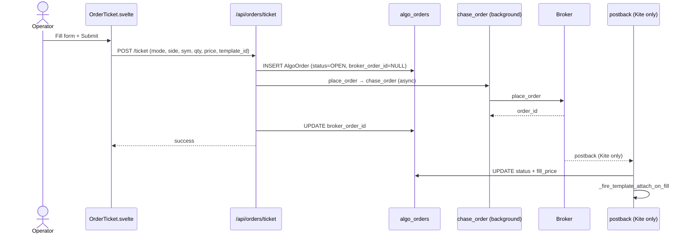

**Files:** `frontend/src/lib/order/OrderTicket.svelte` (submit) → `backend/api/routes/orders.py::ticket_order` → `backend/api/algo/chase.py::chase_order` → postback (Kite) or polling.

**Race-window guard:** AlgoOrder commits with `broker_order_id=NULL` first. Fast IOC fill in this window is caught by postback-fallback matching `(account, symbol, side, qty, status=OPEN)` within 60s.

---

## 6. Order placement — basket (Chain tab)

Multi-leg submission grouped per-account, dispatched in parallel via `asyncio.gather`:

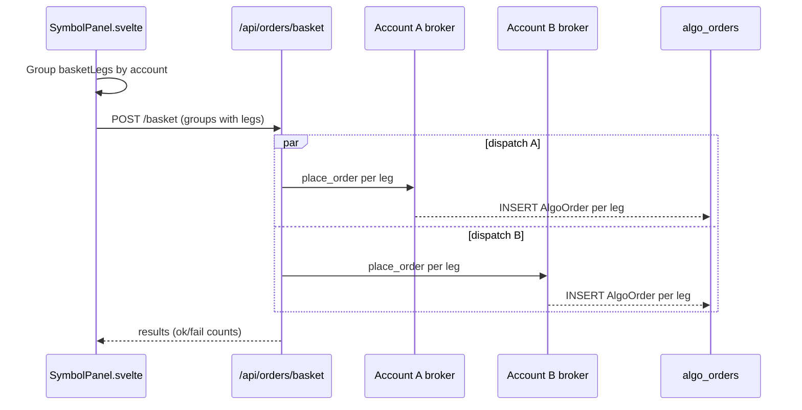

**Files:** `frontend/src/lib/SymbolPanel.svelte::submitBasket` (grouping) → `backend/api/routes/orders.py::place_basket` (parallel dispatch).

**Template isolation:** legs with explicit `template_id` ignore shell overrides. Legs with no `template_id` inherit shell defaults.

---

## 7. Chase loop lifecycle

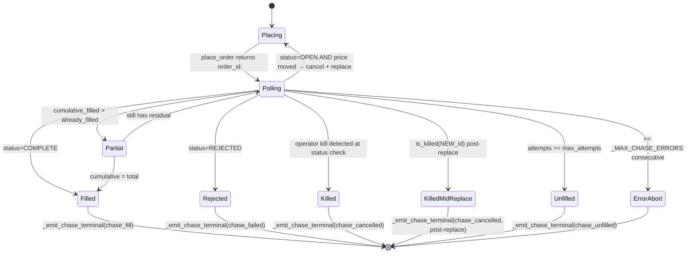

**Key files:**
- `backend/api/algo/chase.py::chase_order` — main loop
- `backend/api/algo/chase.py` — partial-fill branch (search `_record_partial_fill`)
- `backend/api/algo/chase.py` — kill-race post-replace check (search `is_killed(current_order_id)` after `_sync_algo_order_id`)
- `backend/api/algo/chase.py::_emit_chase_terminal` — snapshot + downstream attach
- `backend/api/algo/chase.py::_sync_algo_order_id` — writes `broker_order_id` + `current_limit`

⚙ **TECH — sync polling vs WebSocket order updates** — `WHY` Postback delivery is unreliable for non-Kite brokers (Dhan + Groww are poll-only). Sync polling is the lowest-common-denominator that works everywhere. `WHAT` `chase_order` calls `_order_status` every 20s (configurable per chase). `HOW` Each iteration: depth quote → adjusted limit → cancel old + place new → sync ID → wait → poll status. `WHERE` `backend/api/algo/chase.py`.

**Partial-fill math (post C-1 fix):**
```
already_filled = quantity - remaining_qty
new_delta = cumulative_filled - already_filled
fire partial branch when: cumulative_filled > 0 AND new_delta > 0 AND cumulative_filled < quantity
```

---

## 8. The order/chase/template tripod

This is the most complex part of the codebase. Three subsystems with overlapping responsibilities:

### 8.1 What each one owns

| | Owns | Reads |
|---|---|---|
| **Order routing** (`orders.py`) | The broker-facing entry path. Single ticket + basket. | Settings, templates |
| **Chase loop** (`chase.py`) | The per-order placement lifecycle. Cancel + replace + status polling + partial fill accounting. | Broker, AlgoOrder, kill signal |
| **Template attach** (`template_attach.py`) | Post-fill exit-rule wiring. TP/SL/Wing/Scale/Trail GTTs at the broker. | OrderTemplate, AlgoOrder (read-only at attach time) |

### 8.2 Why three? Why not one big "manage this order" function?

History: the chase loop existed first (single ticket → place + chase to fill). Templates were bolted on later (Phase 0–3 + Sprints A–E). The current shape is intentional — each subsystem can be tested in isolation:

- Chase tests use a mock `_order_status` that returns a scripted sequence.
- Template tests build a `TemplatePlan` directly and assert the GTT spec shape.
- Routes are integration-tested with real broker mocks (`backend/tests/`).

### 8.3 The mode pivot

`mode ∈ {sim, paper, live, shadow}` decides which adapter the order actually hits. The pivot happens at submit time (`_resolve_mode` in `backend/api/algo/actions.py`) and is **persisted on the AlgoOrder row** — every downstream branch (chase terminal, postback, reconcile, template attach) reads `row.mode` to decide whether to call a real broker or the paper engine.

**Gotcha:** the chase loop runs the same code regardless of mode. Paper mode is achieved by injecting the paper engine's `place_order` adapter at the broker registry boundary. Don't add `if mode == 'live'` branches inside chase — the abstraction is the broker registry, not the chase.

---

# Part III — Templates + exits

## 9. Template attach pipeline

```mermaid
flowchart TD
    subgraph triggers [Fill triggers]
        PB[Postback handler<br/>orders.py order_postback]
        CT[Chase terminal<br/>chase.py _emit_chase_terminal]
        RC[Reconcile sweep<br/>orders.py reconcile_*]
        RT[Operator retry<br/>orders.py retry_template]
    end

    PB --> FF[_fire_template_attach_on_fill]
    CT --> FF
    RC --> FF
    RT --> APT[apply_template_to_order]

    FF -->|attached_gtts_json IS NULL guard| APT
    APT --> RP[resolve_template_plan]
    RP --> PLAN[TemplatePlan: gtts + wing]
    APT --> WS[_pick_wing_by_premium<br/>chain scan]
    PLAN --> GTT1[broker.place_gtt — TP]
    PLAN --> GTT2[broker.place_gtt — SL]
    PLAN --> GTT3[broker.place_gtt — scale-out N]
    WS --> WO[broker.place_order — wing leg]
    GTT1 --> AGG[Aggregate result.gtt_ids]
    GTT2 --> AGG
    GTT3 --> AGG
    WO --> AGG
    AGG -->|attached_gtts_json| DB[(algo_orders.attached_gtts_json)]
    AGG --> RES[AttachResult<br/>{ok, errors[], notes[]}]
```

**Key files:**
- `backend/api/algo/template_attach.py::resolve_template_plan` — override merge + scope resolution
- `backend/api/algo/template_attach.py::_pick_wing_by_premium` — OI + spread filters
- `backend/api/algo/template_attach.py::AttachResult` — return type (NOT `TemplateAttachResult` — the docs previously had this wrong)
- `backend/api/routes/orders.py::_fire_template_attach_on_fill` — idempotency guard + persistence
- `backend/api/routes/orders.py::retry_template` — manual re-fire path. Persists `attached_gtts_json` per H-7 + trail-stop scaffolding per Sc.5

**Idempotency:** `_get_template_attach_lock(parent_row_id)` + `attached_gtts_json IS NULL` check. Strong dict with 1h TTL after M-5 fix replaces the prior WeakValueDictionary.

⚙ **TECH — JSON blob vs normalized table for `attached_gtts_json`** — `WHY` Each parent has 1-5 GTTs + maybe a wing. A child table would mean a JOIN on every order grid render. The blob lets us read the whole bracket in one column-fetch. `WHAT` Stored as a JSON array of entries (`{kind: "gtt", label: "TP", id: "...", current_trigger: ..., sl_trail_pct: ...}`). `HOW` Always write atomically (single column update); read+parse on every access (cheap because rows are small). `WHERE` `backend/api/models.py::AlgoOrder.attached_gtts_json` + `_fire_template_attach_on_fill`.

---

## 10. 4-default template matrix

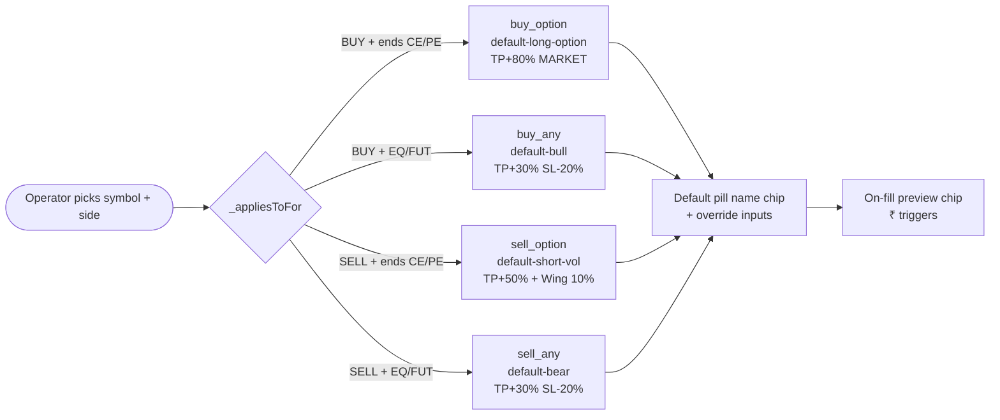

**Key files:**
- `backend/api/algo/templates_seed.py::SYSTEM_TEMPLATES` — seeded defaults + rebalance logic
- `frontend/src/lib/order/OrderTicket.svelte::_appliesToFor`
- `frontend/src/lib/SymbolPanel.svelte::_appliesToFor` — same helper at shell level
- `frontend/src/lib/SymbolPanel.svelte::_sideAwareDefault` — with fallback to focused-leg symbol
- `frontend/src/routes/(algo)/automation/templates/+page.svelte` — coverage view (note: `/automation/templates` is the actual route; older docs reference `/admin/templates` which is stale)

---

## 11. Template override merge

Operator overrides flow through multiple layers; understanding the merge order saves hours of debugging.

```
Request:
  template_id=T1, tp_pct_override=20, sl_pct_override=None

Backend persist (orders.py::_build_overrides_json ~line 541):
  AlgoOrder.template_id          = T1
  AlgoOrder.template_overrides_json = '{"tp_pct": 20}'   # only NON-None overrides

At fill (template_attach.py::_pick):
  tp_pct = _ov.get("tp_pct") or template.get("tp_pct")
       → 20 (override wins)
  sl_pct = _ov.get("sl_pct") or template.get("sl_pct")
       → template's saved sl_pct (no override)
```

**Per-leg vs shell:** when a basket leg has `template_id` set explicitly (not inherited from `_sharedTemplateId`), the SHELL overrides DO NOT flow through. This is the audit-Sc.12 fix — pre-fix the shell's `tp_pct_override` silently contaminated a leg that the operator had retargeted to a different template.

```
submitBasket logic:
  effective_template = leg.template_id ?? shell_template
  if leg has its own template_id:
      tp_override = leg.tp_pct_override  (do NOT fall through to shell)
  else:
      tp_override = leg.tp_pct_override ?? shell.tp_pct_override
```

---

## 12. Chase loop invariants

Six things the chase loop MUST guarantee:

1. **AlgoOrder.broker_order_id always matches the LATEST broker order.** Cancel-and-replace updates this via `_sync_algo_order_id`. Without it the postback handler can't resolve a row by `broker_order_id`.

2. **AlgoOrder.current_limit reflects the latest re-quoted limit.** Added in M-6. ChaseCard renders this when present so the operator sees the live limit, not entry.

3. **AlgoOrder.filled_quantity is monotonic and never exceeds AlgoOrder.quantity.** The `MAX(prior, cumulative)` clamp in `_record_partial_fill` enforces this post C-1 fix. Template attach reads `filled_quantity` to size exit GTTs.

4. **Operator kills take effect on the very next loop iteration.** `mark_killed(broker_order_id)` is synchronous + the loop checks `is_killed(current_order_id)` (a) at status-check time AND (b) immediately after replace (C-2 fix). The dict has a 60-min TTL so a stale kill flag can't survive across days.

5. **Partial fills get persisted on every NEW delta, not just the first.** The branch fires when `cumulative > already_filled` post-C-1 fix.

6. **A chase that hits >= `_MAX_CHASE_ERRORS` consecutive exceptions aborts.** Prevents infinite re-trying against a broker that's down.

Break any of these and template attach sizes wrong, kills get ignored, or zombie chases burn rate limit.

---

## 13. Trail-stop subsystem

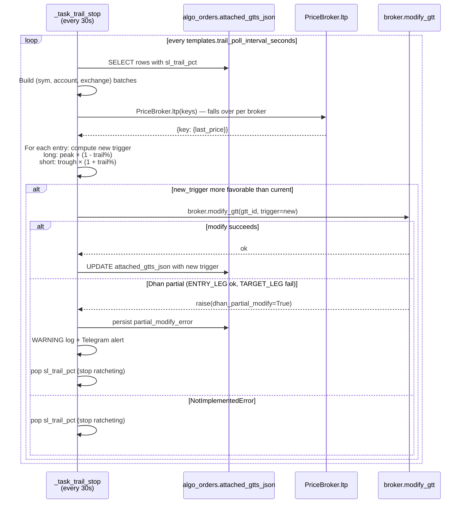

**Key files:**
- `backend/api/background.py::_task_trail_stop`
- `backend/api/background.py` — Dhan partial-modify detect + alert (M-2 fix, search `dhan_partial_modify`)
- `backend/shared/brokers/dhan.py::modify_gtt` — two-leg dispatch (Sprint C)
- `backend/shared/brokers/groww.py` — emulated OCO trail (currently `NotImplementedError`-skip)
- `backend/shared/brokers/dhan.py::ltp` — wired via instruments cache (B-2 fix)

**Asymmetric SELL guard note:** the poller's SELL ratchet check is `current_trigger > 0 AND proposed < current_trigger`. If `current_trigger=0` (entry never persisted), the guard short-circuits → trail silently dead. This is why **every persistence path that writes a trail entry MUST seed `current_trigger`** (see Sc.5a fix in `retry_template`).

---

# Part IV — Brokers

## 14. Broker abstraction

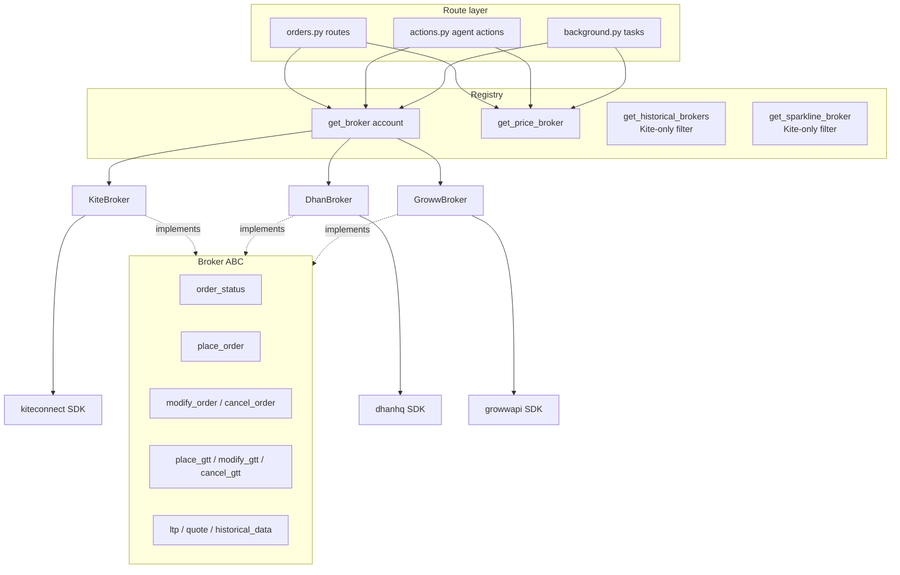

**Capability matrix surface:**
- `backend/shared/brokers/capabilities.py::BrokerCapabilities` — dataclass with every capability flag
- `backend/shared/brokers/registry.py::get_historical_brokers` — Kite-only filter
- `frontend/src/lib/data/brokerCapWarnings.js` — single source of truth for warning strings (H-5)
- `frontend/src/lib/order/OrderTicket.svelte::capWarningFor` — single-account
- `frontend/src/lib/SymbolPanel.svelte::aggregateCapWarnings` — cross-account (H-5)

⚙ **TECH — PriceBroker fallback chain** — `WHY` Some brokers can answer quote/ltp/historical (Kite), some can't (Dhan returns `{}` by design for `quote`). Walking the chain lets the operator's chart still render even when their primary account is throttled. `WHAT` `PriceBroker._try(method_name, *args)` iterates eligible brokers, calls method, checks predicates (`_quote_has_data` / `_ltp_has_data` / `_historical_has_data`), returns first successful response. `HOW` Add a new method by name in the predicate map. Rate-limit cool-off (`_RATE_LIMIT_COOLOFF`) excludes throttled accounts for 30s. `WHERE` `backend/shared/brokers/registry.py::PriceBroker`.

---

## 14.5. Broker abstraction — implementation detail

**Full broker layer architecture** — file map, singleton lifecycle, token caching, source-IP binding, and capability matrix — **lives in [CLAUDE.md §14.5](CLAUDE.md#145-broker-abstraction--implementation-detail) for brevity**. This section is a quick read list only.

**Files** — `backend/shared/brokers/{base.py, kite.py, dhan.py, groww.py, capabilities.py, registry.py}` + `backend/shared/helpers/{connections.py, broker_creds.py, kite_ticker.py}`.

**Key rules:**
1. **Kite-shape contract** — every return value must match Kite Connect shape. Dhan/Groww adapters have `_normalise_*` helpers. The `_DHAN_STATUS_TO_KITE` status map is critical (audit B-1).
2. **Singleton per process** — adapters live via `Connections()` singleton. Each Kite login takes 10-15s; re-doing per-request is unworkable.
3. **IPv6 source-binding** — Kite + Dhan enforce one-session-per-IP rules. Each account binds to a unique IPv6 via `_IPv6SourceAdapter` (Kite/Dhan) or ContextVar proxy (Groww).
4. **Token cache** — each broker persists tokens to `.log/<broker>_tokens.json`. On startup, skips login if fresh token cached; fires full login only on miss/expiry/manual delete.
5. **Registry factories** — use `get_broker(account)` for operator actions, `get_price_broker()` for shared market data, `get_historical_brokers()` for OHLCV + regression, `get_sparkline_broker()` for KiteTicker.
6. **Capabilities immutable** — frozen dataclass with every field explicit per broker (no defaults). Used to render warning chips on OrderTicket when template asks for unsupported GTT shape.

**PriceBroker fallback chain** — when a broker returns empty data (Dhan returns `{}` for MCX quotes by design), walk to the next broker. Rate-limit cool-off excludes throttled accounts for 30s.
    postback_gtt="reliable", rate_limit_orders_sec=10,
)
DHAN_CAPS = BrokerCapabilities(
    broker_id="dhan", display_name="Dhan",
    gtt_single=True, gtt_oco=True, gtt_modify=True,
    gtt_cap_per_account=50, gtt_validity_days=365, gtt_supports_mcx=False,
    bracket_order=True, cover_order=True, atomic_basket=True,
    order_tag=True, margin_preview=True,
    # Audit fix — no Dhan WebSocket / GTT-fire postback handler is wired
    # in the codebase today; detection is the poll-based _task_oco_pair_watcher
    postback_gtt="poll_only",
    rate_limit_orders_sec=20,
)
GROWW_CAPS = BrokerCapabilities(
    broker_id="groww", display_name="Groww",
    gtt_single=True, gtt_oco=False, gtt_modify=True,
    gtt_cap_per_account=25, gtt_validity_days=90, gtt_supports_mcx=False,
    bracket_order=False, cover_order=False, atomic_basket=False,
    order_tag=False,        # No native tag; broker_order_link sidecar covers it
    margin_preview=False,
    postback_gtt="poll_only",
    rate_limit_orders_sec=5,
)
```

OCO emulation for Groww (no `gtt_oco`) is implemented in `groww.py::place_gtt` via two single-trigger GTTs + the `_task_oco_pair_watcher` background task that cancels the surviving sibling when one fires. There's no `gtt_emulated_oco` flag; emulation is an implementation detail behind the adapter.

`CAPS_BY_BROKER_ID` maps both the canonical `"zerodha_kite"` and the legacy `"kite"` alias to `KITE_CAPS`, so older YAML-seeded rows keep resolving without a column rewrite.

Frontend reads via `GET /api/admin/brokers/{account}/capabilities` (in-memory, no broker call). UI helper `brokerCapWarnings.js` consults the matrix to warn the operator at submit time when a template requests a feature the broker can't provide natively.

### 14.5.9 Per-broker quirks worth knowing

These are documented inline in code, but listed here for orientation:

| Broker | Quirk | Where it's handled |
|---|---|---|
| **Kite** | `tag` is 20-char max | `_truncate_tag` in `backend/shared/brokers/kite.py` |
| **Kite** | Postback HMAC validation | `order_postback` route checksum check |
| **Kite** | Rate-limited historical_data quota (low per-second budget) | `_RATE_LIMIT_COOLOFF` 30s window in registry — `_RATE_LIMIT_COOLOFF_SECONDS = 30` |
| **Kite** | One-IP-per-app rule | `_IPv6SourceAdapter` mount |
| **Dhan** | Token dashboard validity defaults to 5min | Operator must extend to 24h in Dhan dashboard |
| **Dhan** | `ltp()` returns `{}` for MCX commodity by design | PriceBroker fallback + B-2 fix logs the empty response |
| **Dhan** | `modify_gtt` needs TWO calls (ENTRY_LEG + TARGET_LEG) | Sprint C dispatch in `dhan.py::modify_gtt` |
| **Dhan** | One-active-token-per-app-per-IP rule | `_IPv6SourceAdapter` + multi-account stabilizer in `Connections` |
| **Groww** | Module-level `requests` calls with no session hook | ContextVar monkey-patch (see §14.5.5) |
| **Groww** | No native OCO | Emulated via two single GTTs + `_task_oco_pair_watcher` cancellation of survivor |
| **Groww** | `cancel_gtt` needs exchange (numeric id collision risk) | M-4 fix raises if exchange missing |
| **Groww** | No `historical_data` support | `historical_data=False` cap; sparkline + chart endpoints fall over to Kite |

### 14.5.10 Modifying the broker layer — guard rails

If you're touching anything in `backend/shared/brokers/`:

- **Never branch in callers by `broker_id`.** The whole point of the abstraction is that callers don't know which vendor they're talking to. If you find yourself writing `if isinstance(broker, KiteBroker)` in a route, the right fix is a new capability flag.
- **Always re-shape vendor responses to Kite shape.** Frontend + chase + template all expect Kite shape. Skipping the normalize step silently breaks things downstream.
- **Status maps are non-negotiable.** Every vendor status must map to a Kite-canonical status (`COMPLETE`, `OPEN`, `CANCELLED`, `REJECTED`, `EXPIRED`, `TRIGGER PENDING`). A missing entry breaks chase fill detection.
- **Wrap sync SDK calls in `asyncio.to_thread`.** Adapters are sync internally; callers MUST go through `asyncio.to_thread(broker.method, ...)` in async handlers to avoid blocking the event loop.
- **Log silent failures.** B-4 audit fix: when a broker SDK returns empty data instead of raising, log `WARNING` with method + symbol + account so the failure surfaces in `api_log_file`.
- **Update `capabilities.py` first.** If you discover a vendor supports something we'd marked `False`, update the matrix BEFORE writing code that uses the feature. Operator-visible warnings flow from the matrix.

---

## 15. How to add a new broker

If you're integrating a new vendor (e.g. "Upstox"):

### Backend

1. **Implement the adapter** in `backend/shared/brokers/upstox.py`. Subclass `Broker` (ABC at `base.py`). Implement EVERY method — there's no "partial" mode. If a method genuinely doesn't apply, raise `NotImplementedError` with a clear message rather than returning empty.

2. **Translate to Kite shape.** Every method that returns operator-facing data (orders, positions, ltp, GTTs) must shape its return to match Kite's structure. Frontend renders are Kite-shape; downstream chase + template code expects Kite-shape. Build a `_normalise_*` helper per category. Mirror the patterns in `dhan.py` and `groww.py`.

3. **Status-string normalization.** Add `_UPSTOX_STATUS_TO_KITE = {...}`. Every Kite-canonical status (`COMPLETE`, `OPEN`, `CANCELLED`, `REJECTED`, `EXPIRED`) must map from one Upstox string. The B-1 audit lesson: a single missing entry silently breaks chase fill detection for an entire broker.

4. **Capabilities.** Add `UPSTOX_CAPS` in `capabilities.py` with EVERY field set explicitly. Don't rely on dataclass defaults — being explicit makes capability gaps visible at code review.

5. **Register in `registry.py`.** Add to `_ADAPTERS` map + `CAPS_BY_BROKER_ID`.

6. **Token caching.** Each broker has its own `.log/<broker>_tokens.json`. Follow the connection wrapper pattern in `connections.py`.

7. **Tests.** Add `backend/tests/test_upstox_broker.py`. Mock the vendor SDK at the boundary; assert your `_normalise_*` outputs.

### Frontend

8. **No frontend code change needed.** The `BrokerCapabilities` dataclass is the contract; the cap warning helper at `brokerCapWarnings.js` reads it generically. Operator-visible capabilities surface automatically.

---

## 16. Broker gotchas

Documented so you don't relearn them the hard way:

| Gotcha | Bit us in |
|---|---|
| **Postback arrives before broker_order_id is committed** | Race window between AlgoOrder pre-persist + seed-broker_id second commit. Fix: fallback recent-NULL-id match (C-3) |
| **Cumulative vs delta in status polls** | Every broker reports `filled_quantity` cumulatively. Pre-fix we added the cumulative value each call → inflation across restarts (C-1) |
| **Kill recorded against old broker_order_id** | Cancel-and-replace creates a new id; kill was only checked against old. Operator's kill silently ignored (C-2) |
| **WeakValueDictionary GC during await** | `_TEMPLATE_ATTACH_LOCKS` could be GC'd between mint and acquire. Fix: strong dict with TTL (M-5). 1h chosen because longest realistic live-chase window is ~30 min; 1h is 2× headroom |
| **Reconcile attach BEFORE commit** | Attach pipeline opened its own session and read pre-commit state. Fix: defer to after commit (C-4 single + bulk) |
| **Empty `_normalise_orders` status map** | Groww's "EXECUTED" passed through verbatim; chase loop never saw "COMPLETE" → no fill detection (B-1) |
| **Dhan `ltp()` returned `{}`** by design until B-2. Trail stop silently dead — no log, no Telegram, just zero ratchet | |
| **Groww `cancel_gtt` blind segment fallback** | Could cancel wrong GTT on numeric id collision. Now raises if exchange missing (M-4) |
| **Naive `datetime.now()` in DB writes** | Mix with tz-aware columns → "AT TIME ZONE" errors. Always `datetime.now(timezone.utc)` |
| **Kite's `tag` is 20-char max** | We truncate via `_truncate_tag` in `chase.py` |
| **Trail-stop persistence missing `current_trigger`** | Asymmetric SELL guard short-circuits with `0`. Every trail-write path must seed (Sc.5a) |
| **OCO double-fire 15s window** | `oco_pair_poll_seconds` default. Matches the `poll_only` GTT detection lag operator sees in the cap warning chip. Telegram alert fires on detection (H-8) |
| **60-second postback fallback window** | Long enough to cover the slowest IOC fill + DB commit race; short enough to avoid cross-pollination with new orders (C-3) |

---

# Part V — Frontend

## 17. Frontend modal state

```mermaid
flowchart TD
    SP[SymbolPanel.svelte]
    SP -->|tab=ticket| OT[OrderTicket.svelte]
    SP -->|tab=chain| OCT[OptionChainTab.svelte]
    SP --> TPL[Template row: Default/None pill]
    SP --> BB[Basket bar pills]
    SP --> CC[ChaseCard.svelte]

    OT --> OD[OrderDepth.svelte]
    OT -->|onMarginUpdate| SP
    OT -->|onPreviewPlanUpdate| SP

    subgraph shellState [Shell-level state]
        SA[_sharedAccount]
        ST[_sharedTemplateId]
        SO[_sharedTpOverride / Sl / Wing×2]
        BL[basketLegs[]]
        FK[_focusedLegKey]
    end

    SP -.binds.-> SA
    SP -.binds.-> ST
    SP -.binds.-> SO
    SP -.owns.-> BL
    SP -.owns.-> FK

    OT -.binds.-> SA
    OT -.binds.-> ST
    OT -.binds.-> SO

    OCT -.binds.-> SA
    OCT -.binds.-> ST
    OCT -.onAddLeg.-> BL

    TPL -.reads.-> ST
    BB -.iterates.-> BL
    BB -.click pill.-> FK
```

**Key files:**
- `frontend/src/lib/SymbolPanel.svelte` — shell + Template row + basket bar + chase card mount
- `frontend/src/lib/order/OrderTicket.svelte` — Ticket form + depth ladder + margin preview
- `frontend/src/lib/order/OptionChainTab.svelte` — strike grid + futures + chain quotes
- `frontend/src/lib/order/OrderDepth.svelte` — bid/ask depth (visibility-gated polling)

**Preview chip swap rule (Chain tab):**
- `basketLegs.length === 0` → Ticket-form preview
- `basketLegs.length > 0` + no focus → last-leg preview
- `_focusedLegKey != null` → that specific leg's preview, badge shows `LEG N/M ●`
- Click any basket pill → set `_focusedLegKey`
- Click chip itself → cycle to next leg
- Operator × on focused leg → key clears, falls back to last-leg

⚙ **TECH — Svelte 5 `$bindable()` props** — `WHY` Two-way sync without prop-drilling or a global store. `WHAT` Child component declares `let { templateId = $bindable(null) } = $props()`; parent writes `bind:templateId={_sharedTemplateId}`. `HOW` Mutations on either side propagate. Avoid `bind:` for derived values (use a `$derived` instead). `WHERE` `SymbolPanel.svelte` ↔ `OrderTicket.svelte` ↔ `OptionChainTab.svelte` template + account props.

---

## 18. Frontend state architecture

### 18.1 Why no global store for order state?

Svelte stores would be the obvious pattern but we don't use them for order modal state. Reasons:

- **Modals are short-lived.** The operator opens, fills, submits, closes. State outlives a single modal mount maybe 5% of the time (basket persists across tab flips).
- **Component-local state with bindable props is enough.** `bind:value` on Svelte 5 runes provides bidirectional sync without the boilerplate.
- **One modal at a time.** We don't need a global "current order context" — the modal owns its context.

The exceptions: `executionMode` (navbar drives every page), `authStore` (every page), `dataCache` (PositionStrip + dashboards share), `orderTemplatesStore` (template CRUD broadcast). These are all narrow — they don't carry order-specific state.

### 18.2 The "shell" pattern

`SymbolPanel.svelte` is a shell. It owns:
- Header (account + symbol pickers)
- Tabs (Ticket / Chain)
- Template row (Default/None pill + override inputs + preview chip)
- Basket bar (when basket has legs)
- Common action footer (margin chip + Submit)

The actual tab content (`OrderTicket.svelte`, `OptionChainTab.svelte`) is mounted as a child. State pipes through:
- **Down via props:** shell → tab (e.g. `_sharedAccount` → `account` prop)
- **Up via callbacks:** tab → shell (e.g. `onMarginUpdate`, `onPreviewPlanUpdate`)
- **Two-way via `bind:`:** for shared mutable state (e.g. `bind:templateId={_sharedTemplateId}`)

When you add a new piece of shell-visible state, decide once:
- Is it tab-specific? → Stay in the tab component.
- Should it survive tab flips? → Lift to shell.
- Does any tab need to READ it? → Pipe down via prop.
- Does any tab need to WRITE it? → `bind:` it.

---

## 19. The preview pipeline

The on-fill preview chip (`on fill → TP ₹250 / SL ₹180 / + Wing BUY ...`) is the single most useful piece of context at submit time. It's computed via two independent pipelines:

- **OrderTicket's `_previewPlan`** ← computed against the Ticket form's symbol/side/qty/price/template.
- **SymbolPanel's `_lastLegPlan`** ← computed against the last basket leg (or operator-focused leg).

The chip render switches between them based on `_activeTab === 'chain' && basketLegs.length > 0`. **Why two pipelines?** Because the inputs are different:
- Ticket: form state, not yet a "leg"
- Last-leg: a fully-formed leg with its own account + symbol + overrides

Both call the same backend endpoint (`previewTicketTemplate`) with the same payload shape. The frontend just feeds them differently.

⚙ **TECH — Backend preview endpoint vs frontend simulation** — `WHY` Operators trust ₹ values that come from the same code path that will ACTUALLY fire on fill. Computing them in the frontend would risk drift; computing them in the backend guarantees the chip reflects reality. `WHAT` `POST /api/orders/preview-ticket-template` returns `{plan: {gtts: [...], wing: {...}, notes: [...]}}`. `HOW` Frontend debounces 200ms after any override change; backend runs `resolve_template_plan` with `apply_path="preview"` so no broker calls fire. `WHERE` `backend/api/routes/orders.py::preview_ticket_template`.

---

# Part VI — Runtime

## 20. Background task topology

```mermaid
gantt
    title Background tasks (app.on_startup)
    dateFormat HH:mm
    axisFormat %H:%M
    section Market data
    Performance refresh (5min)  :perf, 09:00, 6h
    Sparkline warm (daily 00:30) :spark, 00:30, 1m
    Hedge proxy regression (daily 02:30) :hp, 02:30, 5m
    section Order lifecycle
    OCO pair watcher (15s)      :oco, 09:00, 6h
    Trail-stop poller (30s)     :trail, 09:00, 6h
    Ticker watchdog (30s)       :tw, 09:00, 6h
    section Daily ops
    Open summaries              :open, 09:15, 5m
    Close summaries             :close, 15:30, 5m
    MCP audit cleanup (03:15)   :mcp, 03:15, 1m
```

**Key files:**
- `backend/api/background.py` — all task definitions
- `backend/api/app.py::on_startup` — spawn list

**Tasks that touch operator orders:**
- `_task_performance` (5min) — fetches positions/holdings/funds; runs `agent_engine.run_cycle`
- `_task_oco_pair_watcher` (15s) — Groww emulated OCO sibling cancel
- `_task_trail_stop` (30s) — Dhan + Kite trail SL ratchet
- `_task_ticker_watchdog` (30s) — KiteTicker reconnect on disconnect

⚙ **TECH — Why poll-based + not event-based** — `WHY` Vendor postbacks are unreliable (Dhan + Groww have no inbound webhook; Kite drops 0.5-2% in our experience). Polling is the conservative floor. `WHAT` Each task runs on its own asyncio cadence; no scheduler library. `HOW` Pick interval based on operator latency tolerance: trail-stop = 30s (slow ratchet OK), OCO watcher = 15s (faster because both legs settling within window means double-fire). `WHERE` `backend/api/background.py`.

---

## 21. Data refresh — PositionStrip + Dashboard

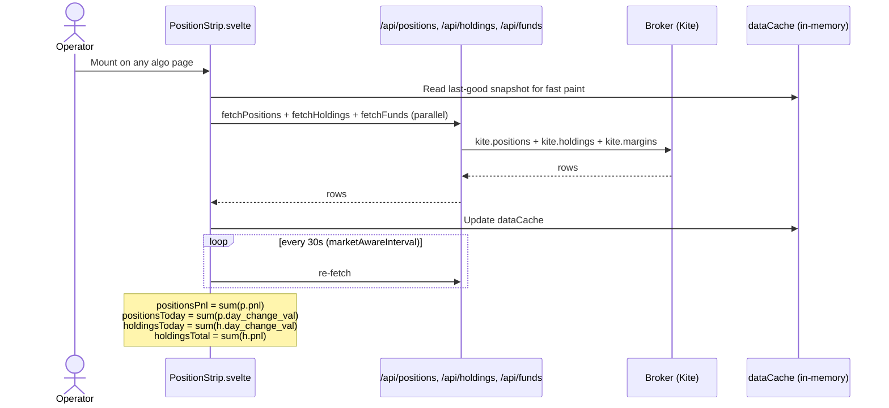

**Key files:**
- `frontend/src/lib/PositionStrip.svelte` — navbar strip aggregations
- `backend/api/routes/positions.py`, `holdings.py`, `funds.py` — REST endpoints
- `backend/shared/helpers/broker_apis.py::fetch_positions / fetch_holdings / fetch_margins`
- `backend/api/cache.py` — server-side cache (per-key locking + TTL)

**`/admin/derivatives` Snapshot TOTAL reconciles to PositionStrip** by adding back the rows the page filters out (equity intraday positions + derivative-looking holdings) via `_excludedByAccount`. See `frontend/src/routes/(algo)/admin/derivatives/+page.svelte` (search `_byUnderlyingTotal`).

⚙ **TECH — `marketAwareInterval` polling vs WebSocket** — `WHY` Position state changes when fills happen; we already get fills via KiteTicker, but positions are aggregated server-side. Polling is cheaper than rebuilding aggregations client-side. `WHAT` `marketAwareInterval(fn, 30000)` polls every 30s during market hours, pauses on `document.hidden`. `HOW` Use the helper from `$lib/stores`; never raw `setInterval`. `WHERE` `frontend/src/lib/stores.js::marketAwareInterval`.

---

## 22. Demo mode

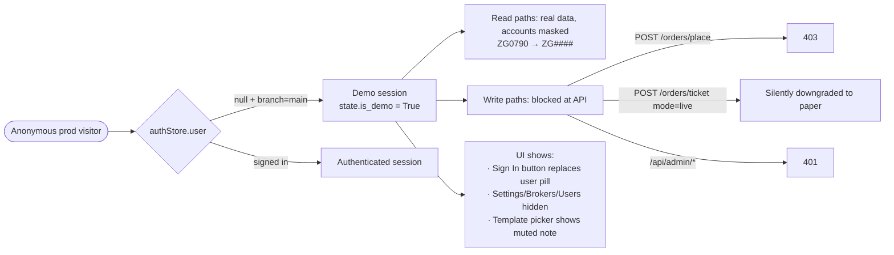

**Key files:**
- `backend/api/auth_guard.py::is_demo_request` + `auth_or_demo_guard`
- `frontend/src/routes/(algo)/+layout.svelte` — demo nav-link gating
- `frontend/src/lib/SymbolPanel.svelte` — template row demo gate (L-3)
- `backend/shared/helpers/broker_apis.py::mask_column` — for demo + public

---

## 22.5. Investor portal — token-as-credential

Public read-only NAV surface for LPs. The URL `/investor/<token>` IS the credential — no login, no password. Operator mints from `/admin` per-user Portal button, copies the URL, forwards through their own channel (WhatsApp / email).

### Why token-as-credential

The boutique fund has 1–5 LPs. Asking each LP to manage a password for a quarterly NAV check is friction nobody wants. Carta, SS&C/GP-Link, and Yieldstreet all converge on the same pattern for LP-facing statements: a long-lived per-LP URL that's revocable on suspicion of leakage. Same threat model as a long-lived API key — if you trust the recipient with the URL, the URL is fine.

⚙ **TECH — Long-lived URL token vs JWT magic-link** — `WHY` JWT magic-links are short-lived (5-15 min); they're great for a one-time "log in to this session" handshake but useless for "bookmark this URL and re-check the value every Friday." The investor portal is a recurring read-only surface, not a session. `WHAT` 32-byte `secrets.token_hex` → 64-char string, 90-day default expiry, revocable. `HOW` Stored raw in `investor_tokens.token` (same convention as `AuthToken` — the token IS the URL slug; hashing adds no security since possession of the URL == access). `WHERE` `backend/api/models.py::InvestorToken`, `backend/api/routes/investor.py`.

### Schema

```python
class InvestorToken(Base):
    __tablename__ = "investor_tokens"
    id, user_id (FK users.id), token (64-char unique),
    expires_at, revoked_at (nullable),
    last_visit_at, visit_count (operator visibility),
    note (admin label), created_by (FK users.id), created_at
```

`Base.metadata.create_all` picks it up on next deploy — no migration.

### Active check

`_is_active(row, now) := row.revoked_at is None AND row.expires_at > now`. Three terminal states surfaced in the admin UI: ACTIVE (green) / REVOKED (red) / EXPIRED (slate).

### Endpoints

**Admin** (`manage_investor_tokens` cap, admin-only):
- `GET /api/admin/users/{id}/investor-tokens` — list (preview only, never full token)
- `POST /api/admin/users/{id}/investor-tokens` — mint (returns full token + portal URL ONCE)
- `DELETE /api/admin/users/{id}/investor-tokens/{tid}` — revoke

**Public** (no auth — token in URL is the credential):
- `GET /api/investor/{token}/slice` → `InvestorSliceResponse` (same math as `/api/nav/me`)
- `GET /api/investor/{token}/history?days=180` → curve

### Visit tracking

`_resolve_token()` bumps `last_visit_at` + `visit_count` on every successful resolve via a best-effort `UPDATE` (try/except, rollback on failure). The operator's admin modal surfaces the timestamp + count so they know "this LP last looked 3 weeks ago" without leaving the page. The counter increments per endpoint hit, so a single page load bumps it by 2 (slice + history).

### Frontend separation

The portal page lives at `frontend/src/routes/investor/[token]/+page.svelte` — sibling of `(public)` and `(algo)` route groups. It inherits only the root `+layout.svelte` (which is empty — just `{@render children()}`), so it gets none of the algo navbar or the public marketing nav. Cream + champagne palette matching the marketing site so LPs land on a "professional statement" page, not a Bloomberg-style trading desk.

Robots `noindex,nofollow` in `<svelte:head>` so leaked URLs don't end up in search engines.

### Revocation model

Revoke is destructive but trivially reversible — admin clicks Revoke (confirms via `ConfirmModal`), `revoked_at` flips to `now()`, next visit 401s. Re-mint creates a new row; the old row stays for the audit trail.

Idempotent: revoking an already-revoked row is a no-op (the original `revoked_at` timestamp is preserved so "when did we revoke this?" remains accurate).

### Source files

- `backend/api/models.py::InvestorToken`
- `backend/api/routes/investor.py` — both controllers
- `backend/api/rbac.py::CAPS["manage_investor_tokens"]`
- `frontend/src/routes/investor/[token]/+page.svelte` — LP-facing page
- `frontend/src/routes/(algo)/admin/+page.svelte` — `openPortal()` modal + mint flow
- `frontend/src/lib/api.js::{fetchInvestorTokens, mintInvestorToken, revokeInvestorToken}`

---

# Part VII — Operations

## 23. How to add a new template field

Templates have grown organically. The current schema is wide (5 mandatory + 7 optional fields). To add a new one:

### Backend

1. **Add the column** to `OrderTemplate` in `backend/api/models.py`.
2. **Idempotent ALTER TABLE** in `backend/api/database.py::init_db`.
3. **Schema fields** in `backend/api/schemas.py` — `OrderTemplate` (response), `OrderTemplateCreate`, `OrderTemplatePatch`. Also `TicketOrderRequest` + `BasketLeg` if you want a per-submit override.
4. **`_build_overrides_json`** in `orders.py` (search for the function name) — add the override → JSON key.
5. **`resolve_template_plan`** in `template_attach.py` — add the `_pick()` call and the GTT spec emission.
6. **Seeded defaults** — update `SYSTEM_TEMPLATES` in `templates_seed.py` if your field should ship with a value.

### Frontend

7. **Template management UI** at `/automation/templates` — add the input.
8. **Override input** at the shell-level Template container in `SymbolPanel.svelte` — add the override field + reset on template change.
9. **Preview** — `previewTicketTemplate` should already wire it because the backend handles it; double-check the chip render handles the new shape.

### Documents

10. **Add a row** to §10 if it's a default field.
11. **Update §11** if your field has unusual merge semantics.

---

## 24. Testing philosophy

The codebase has fewer tests than ideal — that's a known debt. Where tests exist:

- **`backend/tests/`** — pytest + pytest-asyncio. Run via `pytest backend/tests/`.
- **`frontend/e2e/`** — Playwright. Run via `cd frontend && npx playwright test`.
- **No unit tests for frontend** — relies on `svelte-check` + manual flows + e2e.

The Playwright tests run against `dev.ramboq.com` (deployed dev branch). They're slow but high-confidence. Use them for any UX flow that changes; backend pytest for any algo/broker change.

**Rule of thumb:** if you're touching `chase.py`, `template_attach.py`, or any broker adapter, add a pytest test. If you're touching SymbolPanel / OrderTicket flow, add a Playwright spec.

⚙ **TECH — Why Playwright over Cypress** — `WHY` Multi-tab support, native browser context isolation, better async waits. Cypress's same-origin restrictions don't fit our auth flow (OAuth-like JWT). `WHAT` Specs in `frontend/e2e/*.spec.js`. Run with `--workers=1` so dev DB writes don't race. `HOW` Use `expect(...).toContainText(...)` for chip assertions; `toHaveAttribute('placeholder', ...)` for input placeholders. `WHERE` `frontend/e2e/`.

---

## 25. Logging discipline

Three log files matter:

- `api_log_file` — full API log (5MB rotating × 5). Read this first when debugging.
- `api_error_file` — stdout+stderr tee from systemd. Catches uncaught exceptions.
- `hook.log` — webhook listener output.

Log levels by intent:
- `DEBUG` — for trace-style detail. Verbose; filtered out in prod.
- `INFO` — operator-visible events. Order placed, agent fired, chase replaced.
- `WARNING` — recoverable failures. Broker auth retry, asymmetric GTT, partial OCO failure.
- `ERROR` — uncaught exceptions, lost state. Should also trigger Telegram.

**Don't log inside hot loops** without a rate limit. `_task_performance` ran a `logger.info` per row early on; quickly buried `api_log_file` under non-actionable noise.

---

## 26. Deployment notes

Both `dev` and `main` deploy via webhook. Push triggers:

```
GitHub push → webhook.ramboq.com → /etc/webhook/dispatch.sh
  → main:  /opt/ramboq/webhook/deploy.sh prod main
  → other: /opt/ramboq_dev/webhook/deploy.sh dev <branch>
```

`deploy.sh` (per env):
1. `git pull`
2. `pip install` (production deps)
3. `npm run build` (vite)
4. `systemctl restart ramboq_api.service` / `ramboq_dev_api.service`
5. `notify_deploy.py` (Telegram-only since May 2026)

**Per-environment serialisation:** a host-wide `/tmp/ramboq_deploy.lock` prevents concurrent prod + dev builds from race-condition npm conflicts. `nice -n 19 ionice -c 3` on npm so background builds never starve API responsiveness.

**Manual server work after SSH:** always `chown -R www-data:www-data /opt/ramboq /opt/ramboq_dev`. Webhook deploys fail silently if file owner is wrong.

⚙ **TECH — Webhook-based deploy vs CI/CD platform** — `WHY` We're a single-server setup; GitHub Actions would add 30-60s to every deploy plus a $/runner cost. The webhook is bash + git, zero dependencies. `WHAT` `webhook` (Adnan Hajdarbegovic's daemon) listens on port 9000, validates the HMAC, runs `dispatch.sh`. `HOW` Push to a watched branch triggers it automatically. Logs in `hook.log`. `WHERE` `/etc/webhook/hooks.json` (on server); `webhook/dispatch.sh` + `webhook/deploy.sh` (in repo).

---

## 27. Sprint history + audit fixes

Previous fixes are documented in-code via comments. Key milestones:

| Phase/Sprint | Key fixes | Lookup |
|---|---|---|
| Phase 0–3 | Template attach pipeline (resolve → plan → GTT place) | grep `Phase \d` |
| Sprint A–E | Reconcile paths, partial fills, Dhan/Groww OCO, rate limits | grep `Sprint [A-E]` |
| Gap closure (B–L) | 28 audit fixes across categories | `git log --grep="audit fix" -i` |

See commit bodies for specific gap IDs (e.g. B-1 = Dhan status map, C-3 = postback fallback window, H-5 = cap warnings). These are documented in code as defensive comments.

---

# Part VIII — Wrap-up

## 28. Reading order for a new developer

If you've got a week to onboard:

**Day 1 — understand the shape:**
- This doc end-to-end
- `CLAUDE.md` skim (it's the operator-facing manual; some route URLs may reference `/agents/*` which has been redirected to `/automation/*` — see §29)
- `backend/api/app.py` startup wiring
- `backend/api/models.py` schema

**Day 2 — order flow:**
- `frontend/src/lib/SymbolPanel.svelte` + `OrderTicket.svelte` (the modal)
- `backend/api/routes/orders.py::ticket_order` (single submit path)
- `backend/api/algo/chase.py::chase_order` (the loop)

**Day 3 — templates:**
- `backend/api/algo/template_attach.py` (resolve + apply)
- `backend/api/algo/templates_seed.py` (the matrix)
- Trace one BUY CE order from click → fill → attach end-to-end

**Day 4 — brokers:**
- `backend/shared/brokers/base.py` (the ABC)
- `backend/shared/brokers/kite.py` (reference impl)
- `backend/shared/brokers/dhan.py` + `groww.py` (vendor quirks)

**Day 5 — background + extras:**
- `backend/api/background.py` (every task)
- `backend/api/algo/actions.py` (agent action handlers)
- `frontend/src/lib/order/ChaseCard.svelte` + `OrderCard.svelte` (display)

If you've got a day: read §7 (chase loop) above, then read `chase.py::chase_order` source. Everything else extends from that one function.

---

## 29. When in doubt

Open an `Agent` with `subagent_type=audit` and ask it to trace your specific scenario. The audit agents in this codebase are well-calibrated for finding subtle issues. Don't merge a change to `chase.py` or `template_attach.py` without one.

**Known doc-drift in CLAUDE.md** (as of the most recent doc audit): the older operator manual still references `/agents`, `/agents/activity`, `/agents/fragments` URLs. These have been redirected to `/automation`, `/automation/activity`, etc. The redirect routes still work; the URLs in CLAUDE.md are just stale. The current canonical URLs are under `/automation/*`.

---

## 30. Operator's mental model — the one-page summary

| Action | Read this section |
|---|---|
| "What happens when I click Submit on Ticket?" | §5 — single ticket sequence |
| "What does the chase loop do between attempts?" | §7 — chase lifecycle |
| "How does TP/SL get attached?" | §9 — template attach pipeline |
| "Why is my SL not ratcheting on Dhan?" | §13 — trail-stop subsystem |
| "How does the Default pill pick the right template?" | §10 — 4-default matrix |
| "When does the preview chip swap on Chain?" | §17 — frontend modal state |
| "What runs in the background?" | §20 — task topology |
| "Why does the navbar strip not match the dashboard?" | §21 — data refresh paths |
| "What can a demo visitor do?" | §22 — demo mode flow |
| "How do I add a new broker?" | §15 |
| "How do I add a new template field?" | §23 |
| "What's the tech stack?" | §2 — overview; also inline ⚙ TECH callouts throughout |

---

# Part IX — Change recipes (cookbook)

This section turns the design knowledge above into runnable change recipes. Each recipe lists the **exact files to edit**, the **exact pattern to copy**, and the **verification step** before commit. Use these as templates — copy-paste, rename, tweak.

The cookbook is intentionally prescriptive. You do not need to read the full doc above to follow a recipe; you only need §3 (architectural principles) for the philosophy, then jump straight here.

---

## 31. Recipe: add a new route

**Scenario:** you want a new endpoint, e.g. `GET /api/positions/heatmap` that returns aggregated per-symbol stats.

### Steps

1. **Pick the right route file.** `backend/api/routes/` is grouped by domain (`orders.py`, `positions.py`, `holdings.py`, `agents.py`, etc.). Add the new route to the matching file. New domain? Create `heatmap.py`.

2. **Write the msgspec response type** in `backend/api/schemas.py`:
   ```python
   class HeatmapRow(msgspec.Struct):
       symbol: str
       pnl: float
       weight: float
   class HeatmapResponse(msgspec.Struct):
       rows: list[HeatmapRow]
       refreshed_at: str
   ```

3. **Add the route** to the controller (mirror an existing simple route as a template — e.g. `PositionsController.list_positions` in `backend/api/routes/positions.py`):
   ```python
   @get("/heatmap", guards=[auth_or_demo_guard])
   async def heatmap(self, request: Request) -> HeatmapResponse:
       is_demo = request.state.is_demo
       rows = await self._build_heatmap()
       if is_demo:
           rows = [_mask_row(r) for r in rows]
       return HeatmapResponse(rows=rows, refreshed_at=timestamp_display())
   ```

4. **Register the controller** in `backend/api/app.py` if the file is new. Existing controllers don't need re-registration.

5. **Frontend wrapper** in `frontend/src/lib/api.js`:
   ```js
   export const fetchHeatmap = () => _get('/api/positions/heatmap');
   ```
   The wrapper handles auth, retries, demo masking display, and error trimming automatically. **Never call `fetch()` directly from a component** — always go through `api.js`.

6. **Demo masking.** Read paths must mask account values for demo sessions (§22). Use `mask_column(col)` helper, never roll your own.

7. **Verify.** `pytest backend/tests/test_routes_smoke.py` (add a smoke test if the route is non-trivial) + manual curl.

---

## 32. Recipe: add a column to an existing table

**Scenario:** you want `algo_orders.last_chase_quote` to store the last broker depth snapshot.

### Steps

1. **Edit `backend/api/models.py`.** Add the field to the SQLAlchemy model:
   ```python
   last_chase_quote: Mapped[str | None] = mapped_column(Text, nullable=True)
   ```

2. **Add an idempotent ALTER** to `backend/api/database.py::init_db`:
   ```python
   await conn.execute(text(
       "ALTER TABLE algo_orders ADD COLUMN IF NOT EXISTS last_chase_quote TEXT"
   ))
   ```
   The `IF NOT EXISTS` is non-negotiable — `init_db` runs on every startup, idempotency required.

3. **Update msgspec schema** in `backend/api/schemas.py` if the column should be returned over the wire:
   ```python
   class AlgoOrderInfo(msgspec.Struct, kw_only=True):
       ...
       last_chase_quote: str | None = None
   ```
   `kw_only=True` is non-negotiable — the struct interleaves required + optional fields, and Python 3.13's stricter msgspec refuses that without it. Don't strip the modifier when copy-pasting.

4. **Populate it.** Decide which code path writes to it. For our example, `chase.py::chase_order` writes after each depth quote fetch.

5. **Frontend render** (optional). Add a column to `OrderCard.svelte` or `OrderTab.svelte` ag-Grid config; render via cellRenderer.

6. **Verify.** `psql -d ramboq_dev -c "\d algo_orders"` shows the new column; `pytest`; e2e if frontend-visible.

⚠️ **Never write a migration script.** The `init_db` `ALTER TABLE ... IF NOT EXISTS` pattern is the migration mechanism. We don't use Alembic.

---

## 33. Recipe: add a new background task

**Scenario:** you want `_task_unrealized_pnl_alert` that fires every 60s during market hours.

### Steps

1. **Define the coroutine** in `backend/api/background.py`. Copy the shape of `_task_oco_pair_watcher` — it's the simplest template:
   ```python
   async def _task_unrealized_pnl_alert():
       interval = 60
       while True:
           try:
               await _run_unrealized_pnl_check()
           except Exception as e:
               logger.exception(f"_task_unrealized_pnl_alert failed: {e}")
           await asyncio.sleep(interval)
   ```
   **The try/except around the loop body is non-negotiable** — without it, an uncaught exception silently kills the task forever.

2. **Spawn it at startup.** In `backend/api/app.py::on_startup`:
   ```python
   asyncio.create_task(_task_unrealized_pnl_alert())
   ```

3. **Gate by market hours** if appropriate. Use `is_any_segment_open()` from `backend/shared/helpers/date_time_utils.py`:
   ```python
   if not is_any_segment_open():
       await asyncio.sleep(interval)
       continue
   ```

4. **Gate by capability flag.** If the task hits an external service, wrap in `is_enabled('telegram' | 'mail' | …)` so dev branches don't spam.

5. **Verify.** Start dev (`uvicorn backend.api.app:app`), watch `.log/api_log_file` for the task's INFO/DEBUG logs, kill, restart, confirm it picks up cleanly.

⚠️ **Do not use `time.sleep`.** Always `await asyncio.sleep(...)`. Sync sleep blocks the entire event loop.

---

## 34. Recipe: add a new agent action

**Scenario:** you want `square_off_underlying` so an agent can close every position on a given underlying.

### Steps

1. **Add the handler** in `backend/api/algo/actions.py`. Mirror the shape of `_action_close_position`:
   ```python
   async def _action_square_off_underlying(
       action: AgentAction,
       context: dict[str, Any],
   ) -> ActionResult:
       params = action.params or {}
       underlying = params.get("underlying")
       if not underlying:
           return ActionResult(ok=False, reason="missing underlying")
       ...
   ```

2. **Register it** in the `_ACTION_HANDLERS` map at the bottom of `actions.py`:
   ```python
   _ACTION_HANDLERS["square_off_underlying"] = _action_square_off_underlying
   ```

3. **Add the grammar token** in `backend/api/algo/grammar.py::_SYSTEM_TOKENS`:
   ```python
   {
       "grammar_kind": "action",
       "token_kind": "action_type",
       "token": "square_off_underlying",
       "value_type": "enum",
       "resolver": "backend.api.algo.actions._action_square_off_underlying",
       "params_schema": {
           "required": ["underlying"],
           "properties": {"underlying": {"type": "string"}},
       },
       "is_system": True,
       "is_active": True,
   }
   ```

4. **Mode resolution.** Honor `_resolve_mode()` — never call broker directly. Use `get_broker(account)` and respect the row's mode.

5. **Verify.** Create a test agent in dev via `/automation/tokens`, fire-in-simulator, confirm event row + broker call.

---

## 35. Recipe: add a new template field (worked example)

**Scenario:** add `tp_breakeven_lock: bool` — when true, after TP1 fires, modify SL to entry price (free trade).

### Steps

1. **Backend column** in `backend/api/models.py::OrderTemplate`:
   ```python
   tp_breakeven_lock: Mapped[bool | None] = mapped_column(Boolean, nullable=True)
   ```

2. **Idempotent ALTER** in `backend/api/database.py::init_db`:
   ```python
   await conn.execute(text(
       "ALTER TABLE order_templates ADD COLUMN IF NOT EXISTS tp_breakeven_lock BOOLEAN"
   ))
   ```

3. **Schemas** in `backend/api/schemas.py`:
   - `OrderTemplate` (response): `tp_breakeven_lock: bool | None = None`
   - `OrderTemplateCreate`, `OrderTemplatePatch`: same field
   - `TicketOrderRequest`: optional `tp_breakeven_lock_override: bool | None = None` if you want per-submit override
   - `BasketLeg`: same per-leg

4. **Override JSON build** in `backend/api/routes/orders.py::_build_overrides_json` (search for the function):
   ```python
   if data.tp_breakeven_lock_override is not None:
       result["tp_breakeven_lock"] = data.tp_breakeven_lock_override
   ```

5. **Plan resolution** in `backend/api/algo/template_attach.py::resolve_template_plan`:
   ```python
   breakeven_lock = _pick("tp_breakeven_lock", template, overrides)
   ```
   Then emit the appropriate behavior — for breakeven lock, you'd persist it into `attached_gtts_json` and watch for TP1 fill events.

6. **Seeded defaults** in `backend/api/algo/templates_seed.py::SYSTEM_TEMPLATES` — add to whichever defaults should ship with it ON.

7. **Frontend management UI** at `frontend/src/routes/(algo)/automation/templates/+page.svelte`:
   - Add a toggle to the create/edit form
   - Surface it in the listing

8. **Frontend override input** in `frontend/src/lib/SymbolPanel.svelte`:
   - Add a `_sharedTpBreakevenLockOverride = $state(null)` shell-level
   - Render in the Template row alongside the existing override inputs
   - Reset on template change (search the `$effect` block that watches `_sharedTemplateId`)
   - Pass through to OrderTicket and per-leg basket logic

9. **Preview chip.** Backend handles the math; frontend just renders. The preview will automatically pick up the new override because `previewTicketTemplate` passes through the full overrides dict.

10. **Update this doc.** Add a row to §10 (4-default matrix) if any default ships with it, and to §11 (merge order) if your field has unusual merge semantics.

11. **Verify.** `svelte-check`, `pytest`, e2e on `dev.ramboq.com`: create a template with the field, place a paper order, watch the chain of events in `.log/api_log_file`.

---

## 36. Recipe: add a new broker capability flag

**Scenario:** you want to track whether each broker supports iceberg orders (currently not in the matrix).

### Steps

1. **Add the field** to `backend/shared/brokers/capabilities.py::BrokerCapabilities`:
   ```python
   @dataclass(frozen=True)
   class BrokerCapabilities:
       ...                        # existing fields
       iceberg_order: bool        # No default — force explicit setting per broker
   ```
   Note the discipline: real fields don't get defaults (audit B-5 lesson). Every broker constant must set every field.

2. **Set per-broker explicitly** in **all four** constants — KITE/DHAN/GROWW plus the `UNKNOWN_CAPS` fallback at the bottom of `capabilities.py`. Missing UNKNOWN_CAPS will crash the unknown-broker code path at runtime:
   ```python
   KITE_CAPS    = BrokerCapabilities(..., iceberg_order=True)
   DHAN_CAPS    = BrokerCapabilities(..., iceberg_order=False)
   GROWW_CAPS   = BrokerCapabilities(..., iceberg_order=False)
   UNKNOWN_CAPS = BrokerCapabilities(..., iceberg_order=False)  # conservative default
   ```

3. **Capability registry** in `capabilities.py::CAPS_BY_BROKER_ID` already routes by `broker_id` — no change needed.

4. **Frontend warning helper** in `frontend/src/lib/data/brokerCapWarnings.js`:
   - Update the warning-aggregation logic to surface a warning when a template asks for an iceberg leg against a broker where `!caps.iceberg_order`.

5. **Consumer code** queries via `get_broker(account).capabilities.iceberg_order` or the HTTP endpoint `/api/admin/brokers/{account}/capabilities`.

6. **Verify.** Inspect `/admin/brokers` page; the new cap should surface in the row.

---

## 37. Recipe: add a new page

**Scenario:** new admin page at `/admin/funds-history`.

### Steps

1. **Create the route file** `frontend/src/routes/(algo)/admin/funds-history/+page.svelte`. Copy structure from `/admin/brokers/+page.svelte` — it's the simplest admin page template.

2. **Page header.** Use the canonical pattern (see "Page-header rule" in CLAUDE.md or §17 of this doc):
   ```svelte
   <div class="page-header">
     <span class="algo-title-group">
       <h1 class="page-title-chip">Funds History</h1>
     </span>
     <span class="algo-ts">{$nowStamp}</span>
     <span class="ml-auto"></span>
     <span class="page-header-actions">
       <RefreshButton onClick={load} loading={_loading} label="Refresh" />
       <PageHeaderActions />
     </span>
   </div>
   ```

3. **Navbar entry** in `frontend/src/routes/(algo)/+layout.svelte` `navItems`. Pick a group (`monitor` | `analyze` | `modes` | `build` | `config`). Set `adminOnly: true` if it should hide in demo mode.

4. **Data loading.** Always:
   - Use `$effect` for mount + cleanup (not legacy onMount)
   - Use `marketAwareInterval` from `$lib/stores` for polling (not raw setInterval)
   - Read via `$lib/api.js` wrappers

5. **Verify.** Visit the route, check navbar entry, confirm Refresh works, watch console for errors. Playwright spec if non-trivial.

---

## 38. Recipe: add a setting

**Scenario:** add `chase.max_consecutive_errors` so operator can tune the abort threshold (currently hardcoded `_MAX_CHASE_ERRORS=5`).

### Steps

1. **Add to `SEEDS`** in `backend/shared/helpers/settings.py`:
   ```python
   ("chase", "chase.max_consecutive_errors", "int", 5,
    "Abort a chase after this many consecutive API failures", None, "errors"),
   ```

2. **Read it** wherever the constant was used. Replace `_MAX_CHASE_ERRORS` with `get_int('chase.max_consecutive_errors', 5)`. The cache invalidates on every PATCH; reads are O(1).

3. **Verify.** Visit `/admin/settings` → confirm new row in the Chase bucket. Edit it, watch the change take effect on next chase iteration without restart.

⚙ **TECH** — the seeder preserves operator overrides on deploy; only the description / schema / default_value refresh. So bumping the default in code only affects fresh installs.

---

## 39. Recipe: change an existing default template

**Scenario:** operator wants `default-long-option` to have SL −40% instead of no SL.

### Steps

1. **Edit `SYSTEM_TEMPLATES`** in `backend/api/algo/templates_seed.py`:
   ```python
   {
       "name": "default-long-option",
       ...
       "sl_pct": 40,  # was None
       "sl_type": "LIMIT",
   }
   ```

2. **Re-seeder behavior.** On startup, `seed_templates` (in `templates_seed.py`) rebuilds system templates by `name` — operator's edits to custom templates are preserved, but system templates are overwritten. **The operator's pulls of `default-long-option` will get the new SL on next deploy.**

3. **If operator has saved-instance edits** (i.e. clicked Edit on a system template and saved), those land in a separate row keyed by user_id. They survive system re-seed. To force-refresh, the operator deletes their saved copy.

4. **Verify.** Restart dev, hit `/automation/templates`, confirm SL value is updated. Place a test order — fill should trigger SL GTT placement.

---

## 40. Recipe: wire a new notification channel

**Scenario:** add Slack as a notify channel alongside Telegram + email.

### Steps

1. **Add config keys** in `backend/config/secrets.yaml` (manually on server, gitignored):
   ```yaml
   slack_webhook_url: "https://hooks.slack.com/services/..."
   ```

2. **Add capability flag** in `backend/config/backend_config.yaml::cap_in_dev`:
   ```yaml
   slack: True
   ```
   `is_enabled('slack')` returns `True` on main always, else respects this flag.

3. **Add the helper** in `backend/shared/helpers/alert_utils.py`:
   ```python
   def _send_slack(message: str) -> None:
       if not is_enabled('slack'):
           return
       webhook = secrets.get('slack_webhook_url')
       if not webhook:
           return
       requests.post(webhook, json={"text": message}, timeout=5)
   ```

4. **Add the grammar token** for the notify channel:
   ```python
   # backend/api/algo/grammar.py::_SYSTEM_TOKENS
   {
       "grammar_kind": "notify",
       "token_kind": "channel",
       "token": "slack",
       ...
   }
   ```

5. **Wire it in `_dispatch`** in `alert_utils.py` — for each notify event, check `channel == 'slack'` and call `_send_slack`.

6. **UI checkbox** in agent editor (`frontend/src/routes/(algo)/automation/+page.svelte`) — add Slack to the events grid.

7. **Verify.** Create a test agent with Slack notify, fire in simulator, confirm message lands.

---

## 41. Recipe: ship a fix to dev + main

**Scenario:** you've finished a small fix on `dev` branch and want to deploy to prod.

### Steps

1. **Run pre-flight checks locally.**
   - `cd backend && pytest` (or scoped to affected files)
   - `cd frontend && npm run check` (svelte-check)
   - `cd frontend && npx playwright test --workers=1` if frontend-touching

2. **Commit on dev.** Use the conventional format:
   ```
   <Sprint/scope>: <one-line summary>

   <optional body explaining why>

   Co-Authored-By: Claude Opus 4.7 (1M context) <noreply@anthropic.com>
   ```

3. **Push dev.** `git push origin dev`. Webhook triggers dev deploy automatically. Watch logs:
   ```bash
   ssh ramboq "tail -f /opt/ramboq_dev/.log/api_log_file"
   ```

4. **Verify on `dev.ramboq.com`.** Manual smoke test of the changed feature.

5. **Merge to main.**
   ```bash
   git checkout main
   git merge --ff-only dev
   git push origin main
   git checkout dev  # back to dev for next change
   ```

6. **Webhook deploys prod automatically.** Watch `/opt/ramboq/.log/api_log_file`.

7. **Telegram deploy ping** lands in `RamboQuant Alerts` group — confirm.

⚠️ Don't squash-merge. We keep linear history via `--ff-only`.
⚠️ Don't tag releases; we deploy on every push.

---

## 42. Cross-cutting checklist before every commit

Run mentally before every commit. Skipping any of these has burned us before:

- [ ] **Demo mode honored?** Read paths mask accounts; write paths return 403 or downgrade to paper (§22).
- [ ] **Idempotency on side-effects?** Anything that places orders/GTTs needs a guard (§3.2).
- [ ] **Mode resolution?** Order code reads `row.mode` instead of branching by `if live` (§3.4).
- [ ] **Logger discipline?** No `print()`; no logger calls in hot loops (§25).
- [ ] **Hot-loop sleep?** `asyncio.sleep`, never `time.sleep` (§4.3).
- [ ] **TODO/FIXME?** None in code paths; finish or extract.
- [ ] **Old tests still pass?** `pytest` on the closest test file.
- [ ] **svelte-check clean?** No new errors introduced.
- [ ] **CLAUDE.md updated?** If a fact in CLAUDE.md changes, fix it here.
- [ ] **DESIGN_GUIDE.md updated?** This file. Especially recipe sections + line-anchored grep targets if functions moved.
- [ ] **Sprint/audit fix labeled?** Commit body mentions the gap ID or sprint letter so `git log --grep` finds it.
- [ ] **Co-author trailer?** Co-Authored-By line at the end of the commit body.

If you can't tick every box, hold the commit. The cost of pausing is low; the cost of regression is high.

---

## Where to learn more

| If you want to learn… | Read |
|---|---|
| How the operator uses the platform end-to-end | `USER_GUIDE.md` |
| Day-to-day operations + troubleshooting | `ADMIN_GUIDE.md` |
| Agent authoring + testing | `AGENTS_GUIDE.md` |
| Simulator scenarios + Run-in-Simulator | `SIMULATOR_GUIDE.md` |
| Lab + MCP-driven research workflow | `LAB_MCP_GUIDE.md` |
| Operator's-eye-view of every page | `CLAUDE.md` (large, but indexed) |
| **Architecture + change recipes** | **This document** |
