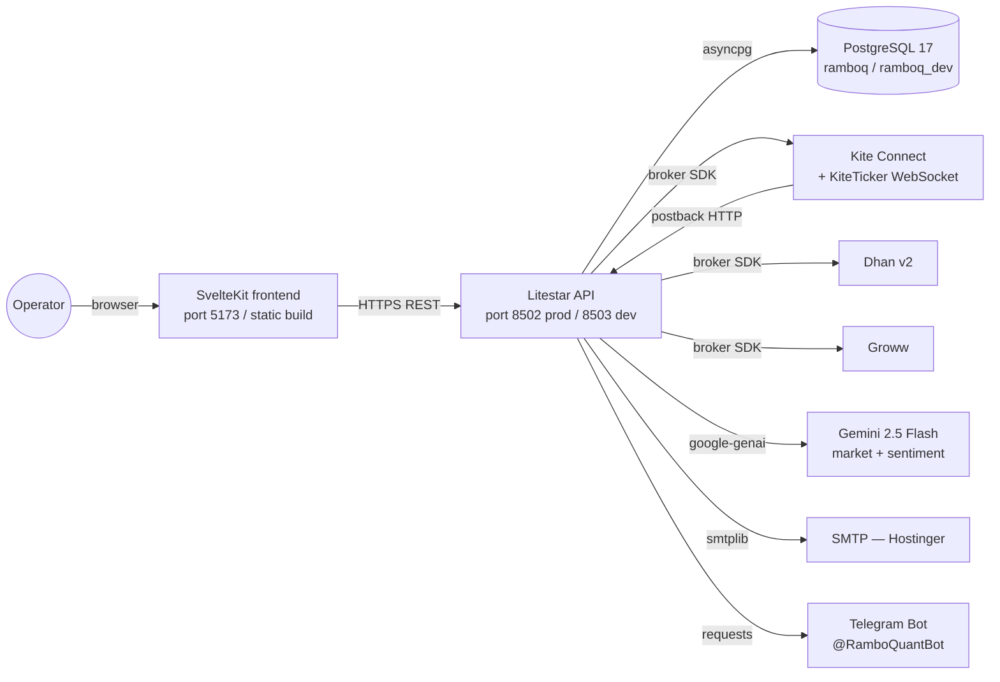
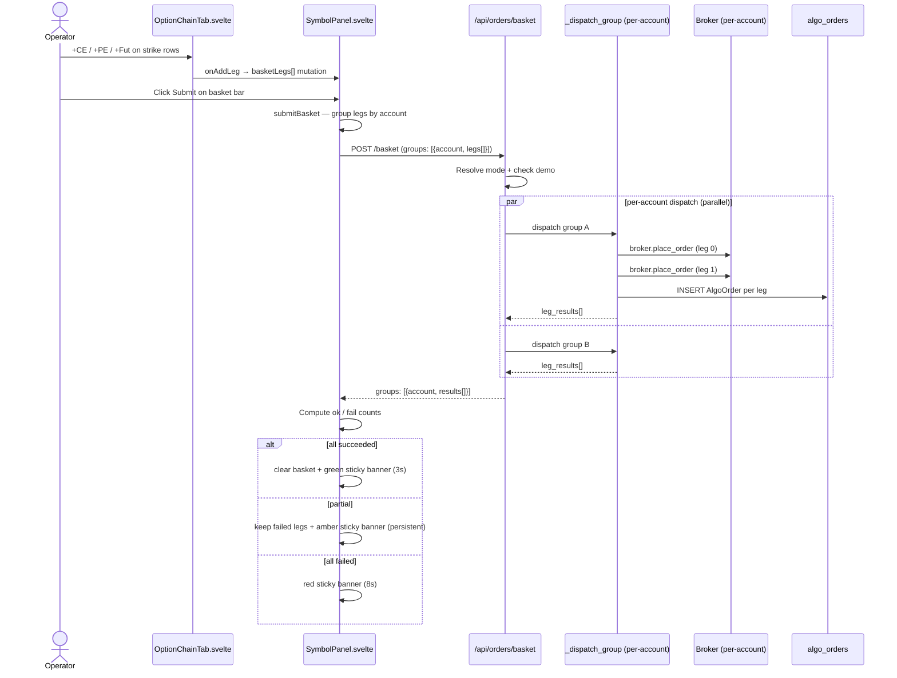
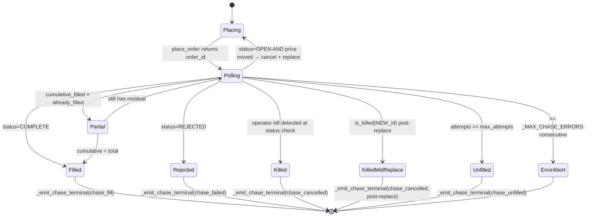
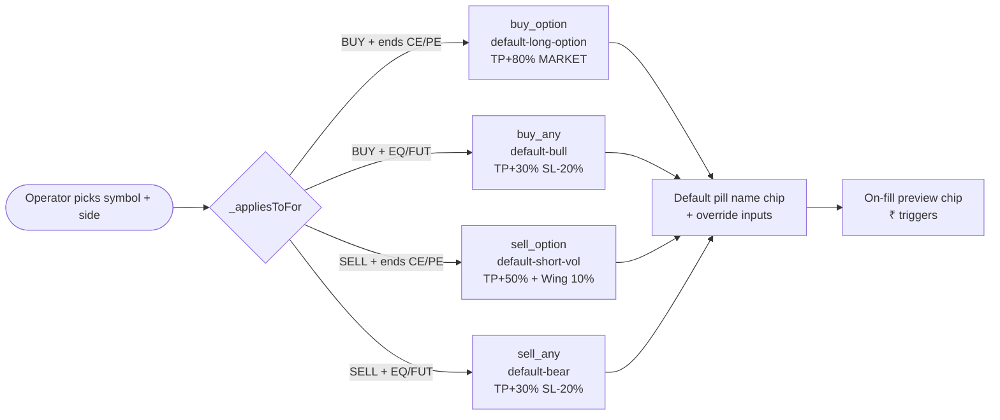
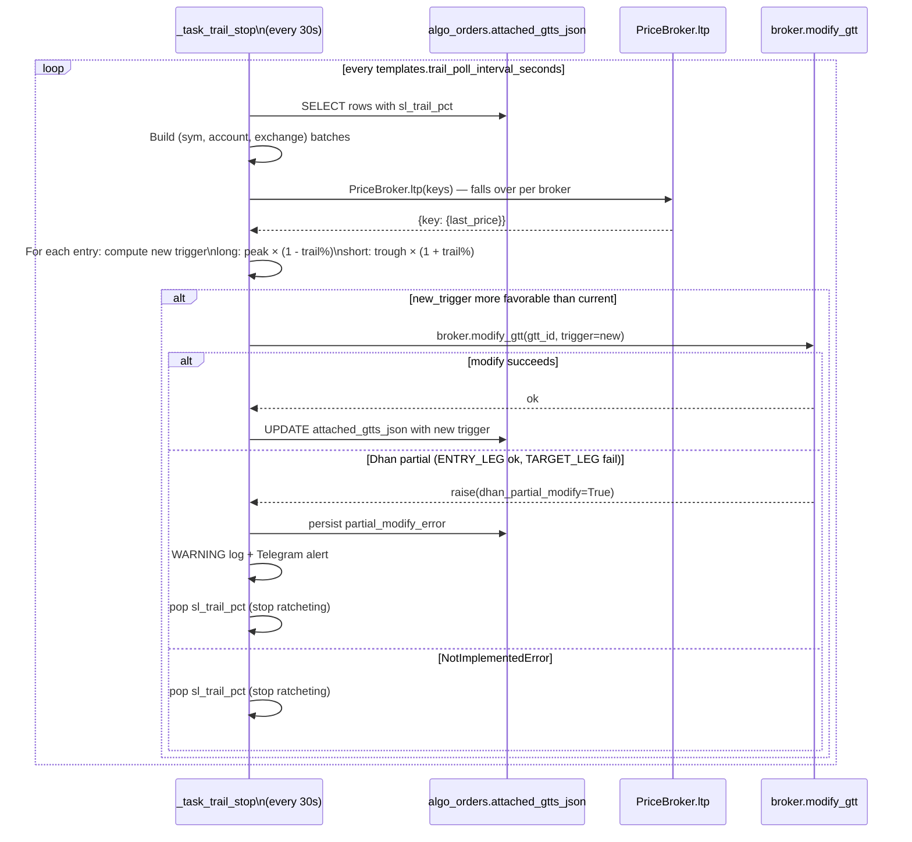
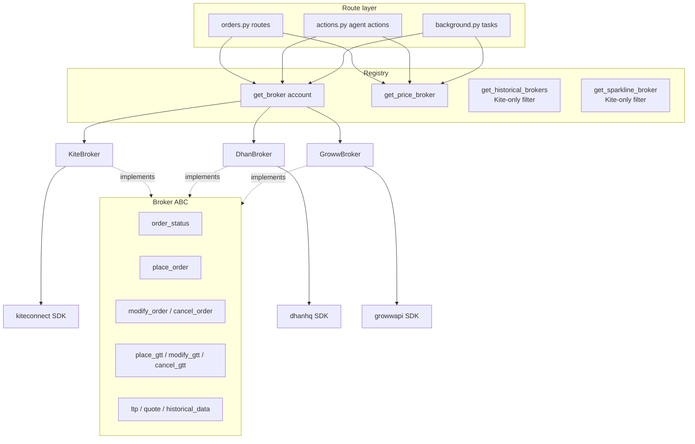
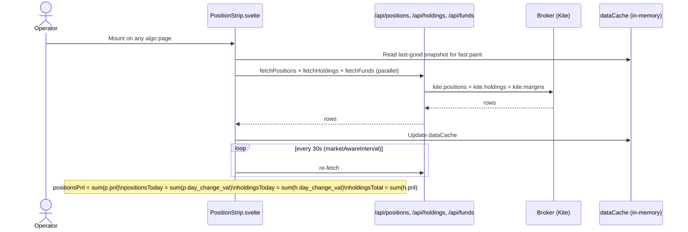
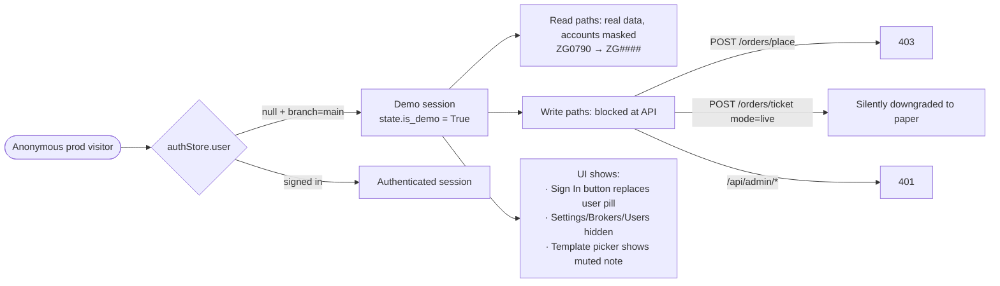
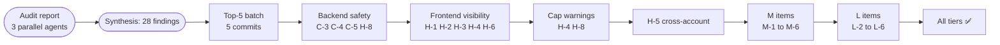

# RamboQuant — Process Flow

End-to-end navigation aid: every operator-critical path with file:line references for the corresponding code. Use this as the top of mind map before reading source. Diagrams use Mermaid.

---

## 1. Architecture overview



| Layer | Tech | Key files |
|---|---|---|
| Frontend | SvelteKit + Svelte 5 runes + ag-Grid + hand-rolled SVG charts | `frontend/src/` |
| API | Litestar 2.x + msgspec.Struct schemas | `backend/api/` |
| DB | PostgreSQL 17 + SQLAlchemy 2.x async + asyncpg | `backend/api/database.py`, `models.py` |
| Brokers | Vendor SDKs behind a unified `Broker` ABC | `backend/shared/brokers/` |
| Background | asyncio tasks spawned at app startup | `backend/api/background.py` |

---

## 2. Order placement — single ticket (Ticket tab)

```mermaid
sequenceDiagram
    actor OP as Operator
    participant OT as OrderTicket.svelte
    participant SP as SymbolPanel.svelte
    participant API as /api/orders/ticket
    participant DB as algo_orders
    participant BR as Broker (Kite/Dhan/Groww)
    participant CH as chase_order (background)
    participant PB as /api/orders/postback (Kite)

    OP->>OT: Fill side + qty + price; click Submit
    OT->>OT: Resolve mode from $executionMode
    OT->>API: POST /ticket (mode, side, sym, qty, price, template_id, overrides)
    API->>API: Demo guard / preflight margin
    API->>DB: INSERT AlgoOrder (status=OPEN, broker_order_id=NULL)
    API->>DB: COMMIT
    alt chase_eligible (LIMIT + price > 0)
        API->>CH: _start_live_chase (async)
        CH->>BR: broker.place_order
        CH-->>API: order_id
    else single-shot (MARKET / SL-M)
        API->>BR: broker.place_order
        BR-->>API: order_id
    end
    API->>DB: UPDATE broker_order_id = order_id
    API->>DB: COMMIT
    API-->>OT: {order_id, status, mode}
    note right of PB: Kite only — postback HMAC verified
    BR-->>PB: order state change webhook
    PB->>DB: UPDATE status + fill_price + filled_at
    PB->>PB: _fire_template_attach_on_fill (async)
```

**Key files:**
- `frontend/src/lib/order/OrderTicket.svelte:1300` — submit handler
- `backend/api/routes/orders.py:2270` — ticket route + AlgoOrder pre-persist
- `backend/api/algo/chase.py:640` — `chase_order` main loop
- `backend/api/routes/orders.py:2680` — postback HMAC + state update
- `backend/api/routes/orders.py:710` — `_fire_template_attach_on_fill`

**Race-window note:** the AlgoOrder row commits with `broker_order_id=NULL` first; the second commit seeds it after `place_order` returns. A fast IOC fill landing in this window is caught by the **postback fallback** at `orders.py:2820` which matches by `(account, symbol, side, qty, status=OPEN, mode=live, created_at >= cutoff)`.

---

## 3. Order placement — basket (Chain tab)



**Key files:**
- `frontend/src/lib/order/OptionChainTab.svelte:600` — `placeBasket` / `onAddLeg`
- `frontend/src/lib/SymbolPanel.svelte:1130` — `submitBasket` per-account groups
- `backend/api/routes/orders.py:3050` — `place_basket` route + `_dispatch_group`
- `frontend/src/lib/SymbolPanel.svelte:1390` — partial-failure sticky banner

**Per-leg vs shell template:** `leg.template_id ?? _sharedTemplateId` resolves to either explicit per-leg pick or shell default. **Per-leg legs with explicit `template_id` IGNORE shell overrides** — see `SymbolPanel.svelte:1180` for the isolation rule.

---

## 4. Chase loop lifecycle



**Key files:**
- `backend/api/algo/chase.py:640` — `chase_order` main loop
- `backend/api/algo/chase.py:740` — partial-fill branch (cumulative-aware after M-6 fix)
- `backend/api/algo/chase.py:720` — kill-race post-replace check (C-2 fix)
- `backend/api/algo/chase.py:60` — `_emit_chase_terminal` snapshot + downstream attach
- `backend/api/algo/chase.py:512` — `_sync_algo_order_id` (writes `broker_order_id` + `current_limit`)

**Partial-fill math (post C-1 fix):**
```
already_filled = quantity - remaining_qty
new_delta = cumulative_filled - already_filled
fire partial branch when: cumulative_filled > 0 AND new_delta > 0 AND cumulative_filled < quantity
```

---

## 5. Template attach pipeline

```mermaid
flowchart TD
    subgraph triggers [Fill triggers]
        PB[Postback handler\norders.py:2715]
        CT[Chase terminal\nchase.py:60]
        RC[Reconcile sweep\norders.py:1560]
        RT[Operator retry\norders.py:1400]
    end

    PB --> FF[_fire_template_attach_on_fill]
    CT --> FF
    RC --> FF
    RT --> APT[apply_template_to_order]

    FF -->|attached_gtts_json IS NULL guard| APT
    APT --> RP[resolve_template_plan]
    RP --> PLAN[TemplatePlan: gtts + wing]
    APT --> WS[_pick_wing_by_premium\nchain scan]
    PLAN --> GTT1[broker.place_gtt — TP]
    PLAN --> GTT2[broker.place_gtt — SL]
    PLAN --> GTT3[broker.place_gtt — scale-out N]
    WS --> WO[broker.place_order — wing leg]
    GTT1 --> AGG[Aggregate result.gtt_ids]
    GTT2 --> AGG
    GTT3 --> AGG
    WO --> AGG
    AGG -->|attached_gtts_json| DB[(algo_orders.attached_gtts_json)]
    AGG --> RES[TemplateAttachResult\n{ok, errors[], notes[]}]
```

**Key files:**
- `backend/api/algo/template_attach.py:400` — `resolve_template_plan` (override merge + scope resolution)
- `backend/api/algo/template_attach.py:160` — `_pick_wing_by_premium` (OI + spread filters)
- `backend/api/routes/orders.py:660` — `_fire_template_attach_on_fill` (idempotency guard + persistence)
- `backend/api/routes/orders.py:1400` — `retry_template` (manual re-fire path, now persists `attached_gtts_json` per H-7)

**Idempotency:** `_get_template_attach_lock(parent_row_id)` + `attached_gtts_json IS NULL` check. Strong dict with 1h TTL after M-5 fix replaces the prior WeakValueDictionary.

**Override merge:** `_pick(field) = _ov.get(field) ?? template.get(field)`. Per-leg overrides win if leg has explicit `template_id`; else shell overrides flow through (see basket isolation rule in §3).

---

## 6. 4-default template matrix



**Key files:**
- `backend/api/algo/templates_seed.py:42` — `SYSTEM_TEMPLATES` + rebalance logic
- `frontend/src/lib/order/OrderTicket.svelte:593` — `_appliesToFor`
- `frontend/src/lib/SymbolPanel.svelte:530` — same helper, shell-level
- `frontend/src/lib/SymbolPanel.svelte:671` — `_sideAwareDefault` with fallback to focused-leg symbol
- `frontend/src/routes/(algo)/automation/templates/+page.svelte` — coverage matrix UI

---

## 7. Trail-stop subsystem



**Key files:**
- `backend/api/background.py:1080` — `_task_trail_stop`
- `backend/api/background.py:1290` — Dhan partial-modify detect + alert (M-2 fix)
- `backend/shared/brokers/dhan.py:960` — `modify_gtt` two-leg dispatch (Sprint C)
- `backend/shared/brokers/groww.py:850` — emulated OCO trail (currently NotImplementedError-skip)
- `backend/shared/brokers/dhan.py:510` — `ltp()` wired via instruments cache (B-2 fix)

---

## 8. Broker abstraction



**Capability matrix surface:**
- `backend/shared/brokers/capabilities.py:42` — `BrokerCapabilities` dataclass
- `backend/shared/brokers/registry.py:438` — `get_historical_brokers` (Kite-only)
- `frontend/src/lib/data/brokerCapWarnings.js` — single source of truth for warning strings (H-5)
- `frontend/src/lib/order/OrderTicket.svelte:650` — `capWarningFor` single-account
- `frontend/src/lib/SymbolPanel.svelte:480` — `aggregateCapWarnings` cross-account (H-5)

**PriceBroker fallback chain:** `_quote_has_data` / `_ltp_has_data` predicates let an empty `{}` from Dhan (intentional for `quote()`) fall through to the next broker silently. Rate-limit cool-off (`_RATE_LIMIT_COOLOFF`) excludes throttled accounts for 30s.

---

## 9. Frontend modal state

```mermaid
flowchart TD
    SP[SymbolPanel.svelte]
    SP -->|tab=ticket| OT[OrderTicket.svelte]
    SP -->|tab=chain| OCT[OptionChainTab.svelte]
    SP --> TPL[Template row: Default/None pill]
    SP --> BB[Basket bar pills]
    SP --> CC[ChaseCard.svelte]

    OT --> OD[OrderDepth.svelte]
    OT -->|onMarginUpdate| SP
    OT -->|onPreviewPlanUpdate| SP

    subgraph shellState [Shell-level state]
        SA[_sharedAccount]
        ST[_sharedTemplateId]
        SO[_sharedTpOverride / Sl / Wing×2]
        BL[basketLegs[]]
        FK[_focusedLegKey]
    end

    SP -.binds.-> SA
    SP -.binds.-> ST
    SP -.binds.-> SO
    SP -.owns.-> BL
    SP -.owns.-> FK

    OT -.binds.-> SA
    OT -.binds.-> ST
    OT -.binds.-> SO

    OCT -.binds.-> SA
    OCT -.binds.-> ST
    OCT -.onAddLeg.-> BL

    TPL -.reads.-> ST
    BB -.iterates.-> BL
    BB -.click pill.-> FK
```

**Key files:**
- `frontend/src/lib/SymbolPanel.svelte` — shell + Template row + basket bar + chase card mount
- `frontend/src/lib/order/OrderTicket.svelte` — Ticket form + depth ladder + margin preview
- `frontend/src/lib/order/OptionChainTab.svelte` — strike grid + futures + chain quotes
- `frontend/src/lib/order/OrderDepth.svelte` — bid/ask depth (visibility-gated polling)

**Preview chip swap rule (Chain tab):**
- `basketLegs.length === 0` → Ticket-form preview
- `basketLegs.length > 0` + no focus → last-leg preview
- `_focusedLegKey != null` → that specific leg's preview, badge shows `LEG N/M ●`
- Click any basket pill → set `_focusedLegKey`
- Click chip itself → cycle to next leg
- Operator × on focused leg → key clears, falls back to last-leg

---

## 10. Background task topology

```mermaid
gantt
    title Background tasks (app.on_startup)
    dateFormat HH:mm
    axisFormat %H:%M
    section Market data
    Performance refresh (5min)  :perf, 09:00, 6h
    Sparkline warm (daily 00:30) :spark, 00:30, 1m
    Hedge proxy regression (daily 02:30) :hp, 02:30, 5m
    section Order lifecycle
    OCO pair watcher (15s)      :oco, 09:00, 6h
    Trail-stop poller (30s)     :trail, 09:00, 6h
    Ticker watchdog (30s)       :tw, 09:00, 6h
    section Daily ops
    Open summaries              :open, 09:15, 5m
    Close summaries             :close, 15:30, 5m
    MCP audit cleanup (03:15)   :mcp, 03:15, 1m
```



**Key files:**
- `backend/api/background.py` — all task definitions
- `backend/api/app.py:on_startup` — spawn list

**Tasks that touch operator orders:**
- `_task_performance` (5min) — fetches positions/holdings/funds; runs `agent_engine.run_cycle`
- `_task_oco_pair_watcher` (15s) — Groww emulated OCO sibling cancel
- `_task_trail_stop` (30s) — Dhan + Kite trail SL ratchet
- `_task_ticker_watchdog` (30s) — KiteTicker reconnect on disconnect

---

## 11. Data refresh — PositionStrip + Dashboard



**Key files:**
- `frontend/src/lib/PositionStrip.svelte` — navbar strip aggregations
- `backend/api/routes/positions.py`, `holdings.py`, `funds.py` — REST endpoints
- `backend/shared/helpers/broker_apis.py` — `fetch_positions / fetch_holdings / fetch_margins`
- `backend/api/cache.py` — server-side cache (per-key locking + TTL)

**`/admin/derivatives` Snapshot TOTAL reconciles to PositionStrip** by adding back the rows the page filters out (equity intraday positions + derivative-looking holdings) via `_excludedByAccount`. See `frontend/src/routes/(algo)/admin/derivatives/+page.svelte:800`.

---

## 12. Demo mode flow



**Key files:**
- `backend/api/auth_guard.py` — `is_demo_request` + `auth_or_demo_guard`
- `frontend/src/routes/(algo)/+layout.svelte` — demo nav-link gating
- `frontend/src/lib/SymbolPanel.svelte` — template row demo gate (L-3)
- `backend/shared/helpers/broker_apis.py` — `mask_column` for demo + public

---

## 13. Audit-fix lineage (visual)



**Closed gaps reference:** see commit history `git log --oneline --grep "audit fix"` for inline traceback. Each commit's body cites the specific gap ID.

---

## Operator's mental model — the one-page summary

| Action | Read this section |
|---|---|
| "What happens when I click Submit on Ticket?" | §2 — single ticket sequence |
| "What does the chase loop do between attempts?" | §4 — chase lifecycle |
| "How does TP/SL get attached?" | §5 — template attach pipeline |
| "Why is my SL not ratcheting on Dhan?" | §7 — trail-stop subsystem + B-2 fix |
| "How does the Default pill pick the right template?" | §6 — 4-default matrix |
| "When does the preview chip swap on Chain?" | §9 — frontend modal state |
| "What runs in the background?" | §10 — task topology |
| "Why does the navbar strip not match the dashboard?" | §11 — data refresh paths |
| "What can a demo visitor do?" | §12 — demo mode flow |
